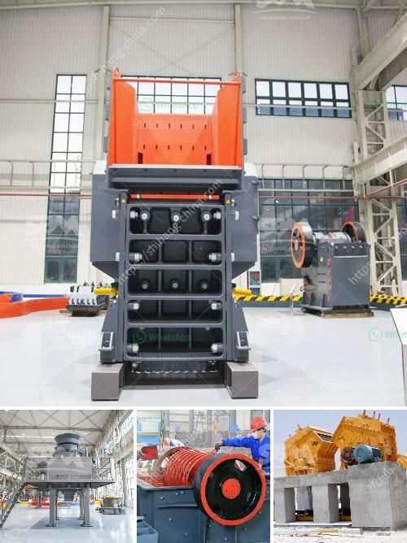

<h3>complete crushing plant 100tph</h3>
The complete crushing plant 100tph is one of the main equipment for producing high-quality sand and gravel aggregate. It is an essential equipment in the construction industry. The finished product can be used as a base material for various buildings and bridges. It not only provides high-quality sand and gravel aggregates for high-rise buildings, highways, railways, water conservancy, and hydropower construction, but also promotes the development of the construction industry. 

The complete crushing plant 100tph includes a vibrating feeder, a jaw crusher, a cone crusher, a vibrating screen, and belt conveyors. A wide range of equipment is available for customers to choose from according to different production requirements. With reliable performance, reasonable structure, and high crushing efficiency, it can meet various crushing needs of customers.

The first step in the process is the vibrating feeder, which can evenly and continuously send materials to the jaw crusher for primary crushing. The jaw crusher, known as the "heart" of the crushing plant, crushes the large-sized stones to a smaller size. The crushed material is then transported to the cone crusher, which is used for secondary crushing. The cone crusher finely crushes the stones into a size that meets the customer's requirements.

After the secondary crushing process, the materials are sent to the vibrating screen for screening. The vibrating screen separates the stones of different sizes. The material that meets the size requirements is sent to the finished product pile through the conveyor belt, while the oversized material is returned to the cone crusher for re-crushing.

The complete crushing plant 100tph has the advantages of high productivity, low operating cost, reliable operation, easy maintenance, and environmental protection. It adopts advanced technology and unique design, making the finished product have uniform particle size, good grain shape, and suitable gradation. 

In addition to the above equipment, the complete crushing plant 100tph can also be equipped with other auxiliary equipment such as dust removal equipment, noise reduction equipment, and sand washing equipment, which can further improve the environmental performance of the production line and ensure the quality of the finished product.

As a professional manufacturer of crushing and screening equipment, we provide customers with a complete range of solutions. The complete crushing plant 100tph is an ideal choice for customers who need high-quality aggregate materials. It can effectively reduce construction costs and improve construction efficiency. With its excellent performance and reliable quality, it has been widely used in various construction projects.
<h3>Contact us</h3><ul><li><strong>Whatsapp:&nbsp;<a href="https://wa.me/8613661969651">+8613661969651</a></strong></li><li><a href="https://swt.shibang-china.com/?git&amp;zhl&amp;complete crushing plant 100tph"><strong>Online Service(chat now)</strong></a></li></ul><h3>Related</h3><ul><li><a href='sand washing plant for sale in south africa.md'>sand washing plant for sale in south africa</a></li><li><a href='stone crusher discount.md'>stone crusher discount</a></li><li><a href='portable diamond processing plant supplier.md'>portable diamond processing plant supplier</a></li><li><a href='basalt manufacturer crusher machine.md'>basalt manufacturer crusher machine</a></li><li><a href='limestone handling system scheme with grinding mill.md'>limestone handling system scheme with grinding mill</a></li></ul>