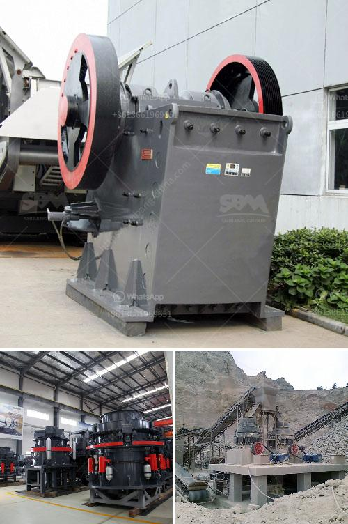

<h3>components for cone crusher major</h3>
The cone crusher is one of the most commonly used crushing equipment in the mining industry. It is mainly used for secondary or tertiary crushing of various materials such as rocks, ores, and minerals. However, with continued use, cone crusher components may appear major components that require attention. In this article, we will shed light on the major components of cone crushers and discuss their importance for ensuring crusher performance.

The main shaft is the uppermost component of the cone crusher. It supports the mantle by rotating smoothly within the eccentric bushing, allowing the mantle to move along the crushing chamber. This rotational movement creates the compression crushing action within the chamber, which helps in reducing the size of the material being crushed.

The eccentric bushing is located at the bottom of the main shaft and is responsible for supporting the bottom end of the main shaft. It provides a smooth rotational movement to the main shaft and helps in maintaining the proper alignment between the eccentricity and the crushing chamber.

The mantle is a cone-shaped component that sits above the main shaft and is attached to it. It is responsible for crushing the material by applying pressure against the concave, or the fixed crushing surface, inside the crushing chamber. The mantle wears out over time and needs to be replaced periodically to ensure optimal performance and product quality.

The concave liner is a fixed component that sits inside the crushing chamber and provides the crushing surface against which the mantle crushes the material. It is typically made of manganese steel, which is known for its high resistance to wear and abrasion. The concave liner needs to be regularly inspected and replaced if necessary to maintain the efficiency and productivity of the cone crusher.

The bowl liner is another important component located beneath the concave liner. It provides the final crushing space between the mantle and the concave liner. The bowl liner also needs to be inspected regularly and replaced if worn out to ensure optimal performance of the cone crusher.

The thrust bearing is located at the bottom of the crusher shaft and is responsible for supporting the axial load from the crushing process. It allows the main shaft to rotate smoothly and remains critical for the overall performance and longevity of the cone crusher. Regular lubrication and maintenance of the thrust bearing is essential to prevent premature failure.

In conclusion, the cone crusher comprises several crucial components that play a significant role in the crushing process. Understanding the major components and their functions is essential for ensuring optimal performance, longevity, and reduced downtime of the cone crusher. Regular inspection, maintenance, and timely replacement of worn-out components will contribute to efficient crushing operations and maximize productivity in the mining industry.
<h3>Contact us</h3><ul><li><strong>Whatsapp:&nbsp;<a href="https://wa.me/8613661969651">+8613661969651</a></strong></li><li><a href="https://swt.shibang-china.com/?git&amp;zhl&amp;components for cone crusher major"><strong>Online Service(chat now)</strong></a></li></ul><h3>Related</h3><ul><li><a href='quartz manufacturing process from mineral.md'>quartz manufacturing process from mineral</a></li><li><a href='mobile dms copper concentrate machine.md'>mobile dms copper concentrate machine</a></li><li><a href='portable ballast crusher.md'>portable ballast crusher</a></li><li><a href='marble crusher machine in rajasthan.md'>marble crusher machine in rajasthan</a></li><li><a href='crusher manufacturers in ahmedabad.md'>crusher manufacturers in ahmedabad</a></li></ul>