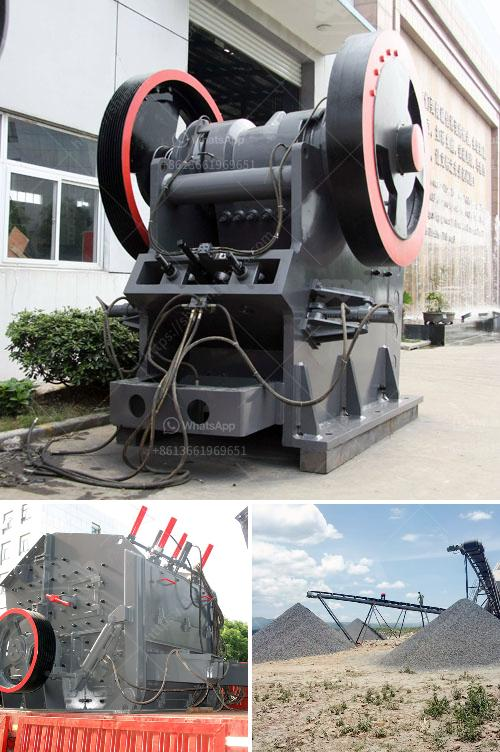

<h3>composition of ball mill liner</h3>
The ball mill liner is an integral part of the mill shell; it protects the mill's inner shell from wear and impacts. The configuration of the liner's design will affect the overall grinding efficiency of the mill and its service life. To determine the composition of the ball mill liner, it is essential to consider the type of grinding mill being used.

Different types of mills require different types of liners, such as grid liners, end liners, and stepped liners. Grid liners are generally used for overflow mills and are commonly made of rubber or rubber composite materials. They are highly resistant to abrasion, which helps prolong the service life of the liner. End liners, on the other hand, are used in both overflow and grate discharge mills. They are often made of cast iron or manganese steel and are designed to prevent the grinding medium from abruptly impacting the mill's end wall.

Stepped liners, as the name suggests, have a stepped structure, allowing for efficient energy transfer between grinding media and particles. These liners are commonly made of high-chrome or white iron, offering excellent wear resistance and maximizing the mill's grinding capacity.

Other factors to consider when determining the composition of a ball mill liner include the size of the grinding media being used, the particle size of the material to be ground, and the hardness of the material being ground. These factors will influence the material chosen for the liner to ensure optimal grinding performance.

In conclusion, the composition of a ball mill liner is a compromise between extending the service life of the liner and ensuring optimal grinding performance. Different types of liners are used for different grinding mills, and it is important to choose the right liner for the specific application. By considering factors such as mill type, grinding media size, and material hardness, one can choose the right liner composition to enhance the mill's efficiency and prolong its service life.
<h3>Contact us</h3><ul><li><strong>Whatsapp:&nbsp;<a href="https://wa.me/8613661969651">+8613661969651</a></strong></li><li><a href="https://swt.shibang-china.com/?git&amp;zhl&amp;composition of ball mill liner"><strong>Online Service(chat now)</strong></a></li></ul><h3>Related</h3><ul><li><a href='capacity of hammer mills used in kenya.md'>capacity of hammer mills used in kenya</a></li><li><a href='products mobile cone crusher.md'>products mobile cone crusher</a></li><li><a href='iron separator from steel slag.md'>iron separator from steel slag</a></li><li><a href='construction material recycling.md'>construction material recycling</a></li><li><a href='quarry equipment uk.md'>quarry equipment uk</a></li></ul>