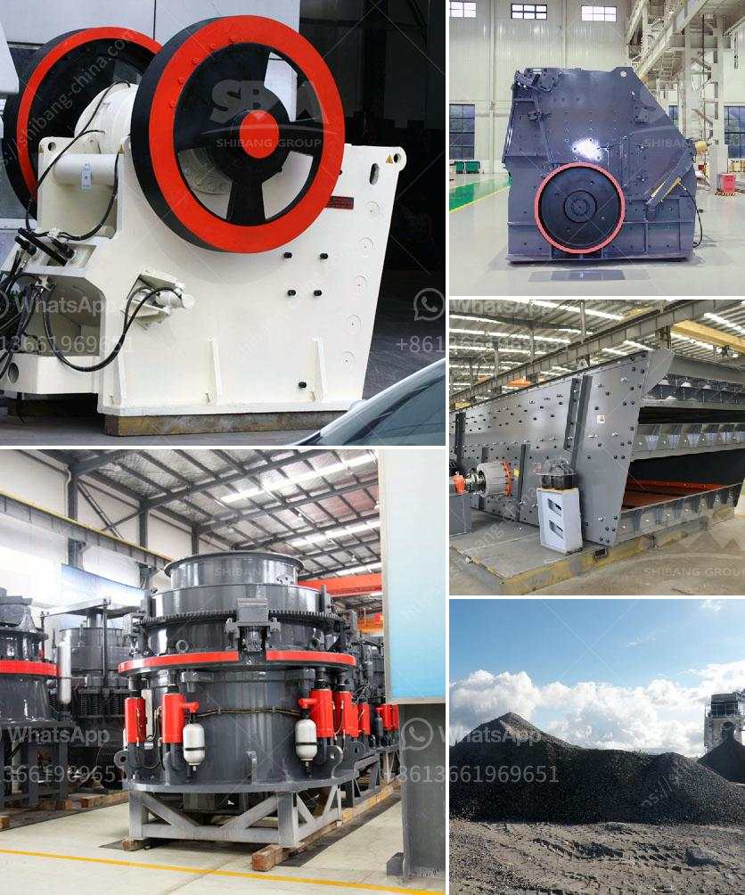

<h3>concrete aggregate recycle machine</h3>
Construction and demolition waste have become a significant concern in recent years due to its massive contribution to environmental pollution. However, one innovative solution that is gaining popularity is the use of concrete aggregate recycle machines. These machines have revolutionized the way we deal with construction waste by providing a sustainable and eco-friendly solution.

The concrete aggregate recycle machine is designed to efficiently recycle construction and demolition waste into reusable aggregates. The machine utilizes a crushing mechanism to break down the waste material into smaller pieces, which can then be used as a substitute for natural aggregates in various construction projects.

One of the significant advantages of using this machine is the reduction of construction waste sent to landfills. By recycling the waste on-site, contractors can significantly reduce their carbon footprint and contribute to a cleaner and greener environment. This practice aligns with the principles of circular economy, where resources are reused and recycled instead of being discarded as waste.

Another benefit of utilizing the concrete aggregate recycle machine is the cost savings it offers. By using recycled aggregates, contractors can reduce the need to purchase large quantities of natural aggregates, resulting in considerable cost savings. Additionally, the use of recycled aggregates can also help in minimizing transportation costs, as the waste material is processed on-site and can be used immediately.

Recycled aggregates produced by the machine offer comparable quality to natural aggregates, making them suitable for various construction applications. These recycled aggregates are commonly used in the production of new concrete, road base materials, and even as backfill for excavated areas. Contractors can confidently utilize these recycled materials without compromising the structural integrity of their projects.

One of the main reasons why the recycling process is so effective is the separation of different materials during operation. The concrete aggregate recycle machine utilizes a screening system that separates the waste material into different sizes, ensuring that only suitable aggregates are used. This screening process helps to remove contaminants and ensure the quality of the recycled aggregates.

Moreover, the concrete aggregate recycle machine is designed to be highly efficient and user-friendly. The machines are often portable and can be easily transported to construction sites, allowing contractors to recycle waste materials on-site. The machines are also equipped with advanced technology, such as automated controls and sensors, to ensure optimal performance and minimal downtime.

In conclusion, the concrete aggregate recycle machine offers a sustainable and eco-friendly solution for recycling construction and demolition waste. By using this machine, contractors can reduce their carbon footprint, save costs, and contribute to a cleaner environment. The production of high-quality recycled aggregates allows for their use in various construction applications. As the construction industry continues to prioritize sustainability, the concrete aggregate recycle machine will undoubtedly play a vital role in reducing waste and promoting a more sustainable future.
<h3>Contact us</h3><ul><li><strong>Whatsapp:&nbsp;<a href="https://wa.me/8613661969651">+8613661969651</a></strong></li><li><a href="https://swt.shibang-china.com/?git&amp;zhl&amp;concrete aggregate recycle machine"><strong>Online Service(chat now)</strong></a></li></ul><h3>Related</h3><ul><li><a href='gold mining project cost.md'>gold mining project cost</a></li><li><a href='turkey jaw crushers in istanbul.md'>turkey jaw crushers in istanbul</a></li><li><a href='bentonite clay processing production line supplier.md'>bentonite clay processing production line supplier</a></li><li><a href='ton day cement clinker grinding plant.md'>ton day cement clinker grinding plant</a></li><li><a href='tonne an hour ball mill.md'>tonne an hour ball mill</a></li></ul>