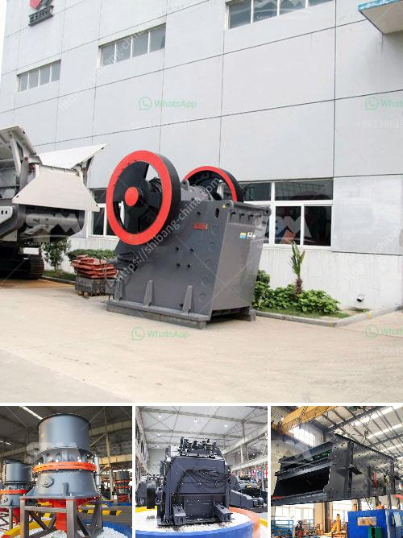

<h3>concrete crusher hire nigeria</h3>
Construction projects are often confronted with various challenges, especially the issue of waste disposal. Proper waste management is essential for maintaining a safe and clean construction site, as well as reducing the environmental impact of the project. One of the key aspects of waste management in the construction industry is the effective crushing and recycling of concrete waste.

Concrete Crusher Hire Nigeria is a cost-effective solution for concrete crushing and recycling projects. With the ability to move freely and easily, it is compact, versatile, and easy to handle, making it a popular choice for waste management on construction sites all over Nigeria.

The crusher eliminates the need for bulky rubble or reinforced concrete to be transported off-site for crushing, saving time and money. Instead, the waste materials can be crushed directly on-site, reducing transportation costs and the need for additional landfill space.

One of the main advantages of hiring a concrete crusher is its ability to crush concrete into reusable materials. By crushing concrete waste into gravel-like materials, it can be used as a base for new construction projects, making it an eco-friendly alternative to traditional gravel. The crushed concrete can also be used for backfilling or as a sub-base for roads, driveways, and parking lots.

Another benefit of concrete crusher hire is the reduction in the amount of waste that ends up in landfills. Construction waste, especially concrete waste, takes up a significant amount of space in landfills, contributing to environmental pollution. By recycling concrete waste, not only is space saved in landfills, but it also reduces the need for extracting and processing raw materials.

Furthermore, concrete crusher hire Nigeria helps in improving overall construction site safety. Instead of having large piles of rubble or concrete debris at the site, which can pose safety hazards and potential accidents, the waste materials can be managed and crushed on-site. This also eliminates the need for labor-intensive manual handling and reduces the risk of injury to workers.

When considering concrete crusher hire in Nigeria, it is important to choose a reputable and experienced company that provides reliable equipment and professional services. The crusher should be well-maintained and in good working condition to ensure optimum productivity and efficiency.

Additionally, it is essential to comply with all relevant environmental regulations and obtain the necessary permits and licenses for crushing and recycling concrete waste. Working with a company that is knowledgeable about local regulations and guarantees proper disposal of all waste materials is crucial for a successful and sustainable construction project.

In conclusion, Concrete Crusher Hire Nigeria is a practical and eco-friendly solution for construction projects that require efficient waste disposal. It offers numerous benefits, including cost savings, reduced environmental impact, and improved site safety. By hiring a concrete crusher, construction companies in Nigeria can effectively manage and recycle concrete waste, contributing to a greener and more sustainable future.
<h3>Contact us</h3><ul><li><strong>Whatsapp:&nbsp;<a href="https://wa.me/8613661969651">+8613661969651</a></strong></li><li><a href="https://swt.shibang-china.com/?git&amp;zhl&amp;concrete crusher hire nigeria"><strong>Online Service(chat now)</strong></a></li></ul><h3>Related</h3><ul><li><a href='new technology stone crusher.md'>new technology stone crusher</a></li><li><a href='limestone production machinery.md'>limestone production machinery</a></li><li><a href='grinding mill machine in sri lanka.md'>grinding mill machine in sri lanka</a></li><li><a href='small ball mill for sale zimbabwe.md'>small ball mill for sale zimbabwe</a></li><li><a href='rock crusher plant for sale.md'>rock crusher plant for sale</a></li></ul>