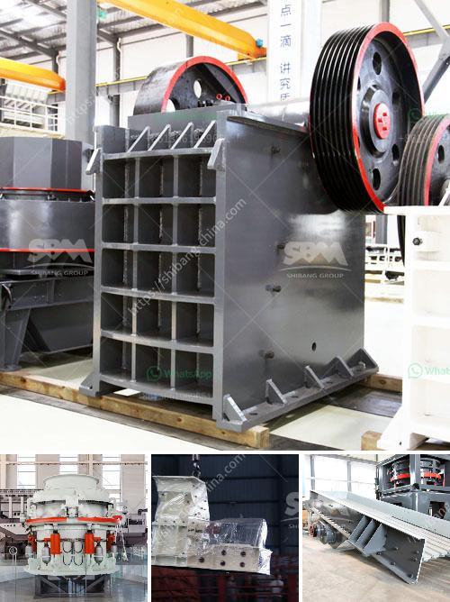

<h3>concrete crusher machine for sale</h3>
Crushed concrete is a viable economic alternative to traditional aggregate materials used in the construction of roads, buildings, and other structures. Not only does crushed concrete help reduce the environmental impact of construction, but it also helps save money by reducing the need for virgin aggregates. To efficiently crush concrete into smaller pieces, several types of concrete crusher machines are available in the market. These machines work by exerting force on concrete material, thereby breaking it down into smaller chunks and removing any impurities in the process. In this article, we will explore the benefits of using a concrete crusher machine for sale and take a closer look at the features that make it a reliable choice for various construction projects.

One of the primary advantages of using a concrete crusher machine is its versatility. These machines can handle a wide range of materials, including concrete, stone, and asphalt, and produce different sizes of crushed aggregates. Whether you need coarse or fine aggregates, a concrete crusher machine can efficiently break down these materials, creating a consistent product that meets your specific requirements.

When considering a concrete crusher machine, one must also evaluate its efficiency and productivity. Modern machines often come equipped with advanced technology and features that enhance their performance. For instance, some crushers have hydraulic systems that allow for effortless adjustment of the crushing gap, ensuring consistent product size. This feature proves invaluable when working on projects that require precise sizing or varying sizes of crushed materials.

Another important consideration when choosing a concrete crusher machine for sale is its mobility. Many construction projects require crushers to be operated at different locations. Mobile crushers, which are designed to be easily transported, can be a game-changer for such projects. These machines can be moved quickly and effortlessly, reducing downtime and increasing productivity. Additionally, with the advent of remote control systems, operators can control the crusher from a safe distance, further enhancing safety on the job site.

Furthermore, the longevity and durability of a concrete crusher machine are crucial factors that should not be overlooked. The machine must be built to withstand the demanding conditions of construction sites, where heavy materials and sharp debris can pose a threat to the equipment. High-quality construction materials and robust designs ensure that the machine can handle such harsh conditions without compromising its functionality or posing a risk to the operator.

In conclusion, a concrete crusher machine is a versatile and cost-effective solution for many construction projects. Its ability to efficiently crush various materials, easy mobility, and advanced features make it a reliable choice. Before purchasing a concrete crusher machine for sale, it is important to consider factors such as versatility, efficiency, mobility, and durability. By doing so, construction companies can ensure that they are investing in a machine that meets their specific requirements and offers value for their money.
<h3>Contact us</h3><ul><li><strong>Whatsapp:&nbsp;<a href="https://wa.me/8613661969651">+8613661969651</a></strong></li><li><a href="https://swt.shibang-china.com/?git&amp;zhl&amp;concrete crusher machine for sale"><strong>Online Service(chat now)</strong></a></li></ul><h3>Related</h3><ul><li><a href='gypsum deposit in indonesia.md'>gypsum deposit in indonesia</a></li><li><a href='tons hour gold wash plant.md'>tons hour gold wash plant</a></li><li><a href='bauxite ore processing equipment price.md'>bauxite ore processing equipment price</a></li><li><a href='grinding ball mill equipment.md'>grinding ball mill equipment</a></li><li><a href='calcite powder lime stone.md'>calcite powder lime stone</a></li></ul>