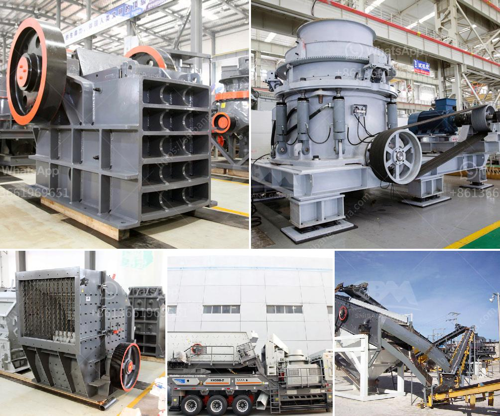

<h3>concrete stone making machine south africa</h3>
Concrete stone making machines are becoming increasingly popular in South Africa due to their efficiency, cost-effectiveness, and durability. These machines are capable of producing high-quality concrete stones with different shapes, sizes, and textures, making them ideal for various construction purposes.

One of the key benefits of using a concrete stone making machine is the ability to produce stones on-site, eliminating the need for transportation and reducing overall costs. The machine operates by mixing cement, sand, and water to form a homogenous mixture that is then poured into molds. These molds can be customized to create various stone shapes, including bricks, pavers, blocks, and tiles.

The process of using a concrete stone making machine in South Africa is relatively simple. The operator places the required amount of cement, sand, and water into the machine’s mixer. The machine then mixes the ingredients thoroughly to ensure a consistent and high-quality mixture. Once the mixture is ready, it is poured into the molds and compacted using a hydraulic press or vibration mechanism.

The compacted mixture is left to cure for a specific amount of time, typically 24 to 48 hours, depending on the thickness and size of the stones. After the curing period, the stones are removed from the molds and can be used immediately or further processed, such as surface polishing, coloring, or engraving.

Concrete stone making machines offer numerous advantages over traditional methods of stone production. Firstly, these machines are highly efficient, capable of producing a large number of stones within a short period of time. This is particularly beneficial for construction projects with tight deadlines.

Secondly, concrete stones produced by these machines are of superior quality. The machine ensures a consistent mixture, resulting in stones with uniform density, strength, and durability. This makes them suitable for a wide range of applications, including driveways, pathways, walls, and facades.

Furthermore, the versatility of concrete stone making machines allows for the production of stones with different textures and finishes. By using different molds and surface treatment techniques, the machines can create stones that mimic natural materials like stone, brick, or wood. This provides architects and builders with a wide variety of design options, allowing them to achieve their desired aesthetic while maintaining the benefits of concrete.

Additionally, concrete stone making machines contribute to a more sustainable construction industry. The use of concrete significantly reduces the demand for natural stone, which can deplete finite resources and cause environmental damage. Moreover, the durability of concrete stones ensures long-term use, minimizing the need for frequent replacements.

In conclusion, concrete stone making machines are revolutionizing the construction industry in South Africa by offering an efficient, cost-effective, and sustainable method of stone production. These machines provide builders with high-quality and customizable stones, allowing for creative design solutions. As demand for construction materials continues to grow, concrete stone making machines will undoubtedly play a crucial role in meeting this demand while promoting sustainable development.
<h3>Contact us</h3><ul><li><strong>Whatsapp:&nbsp;<a href="https://wa.me/8613661969651">+8613661969651</a></strong></li><li><a href="https://swt.shibang-china.com/?git&amp;zhl&amp;concrete stone making machine south africa"><strong>Online Service(chat now)</strong></a></li></ul><h3>Related</h3><ul><li><a href='cost setting up limestone mine.md'>cost setting up limestone mine</a></li><li><a href='rock stone milling machine.md'>rock stone milling machine</a></li><li><a href='portable limestone crushing systems.md'>portable limestone crushing systems</a></li><li><a href='mobile crushing stone machines from austria.md'>mobile crushing stone machines from austria</a></li><li><a href='clay processing technology.md'>clay processing technology</a></li></ul>