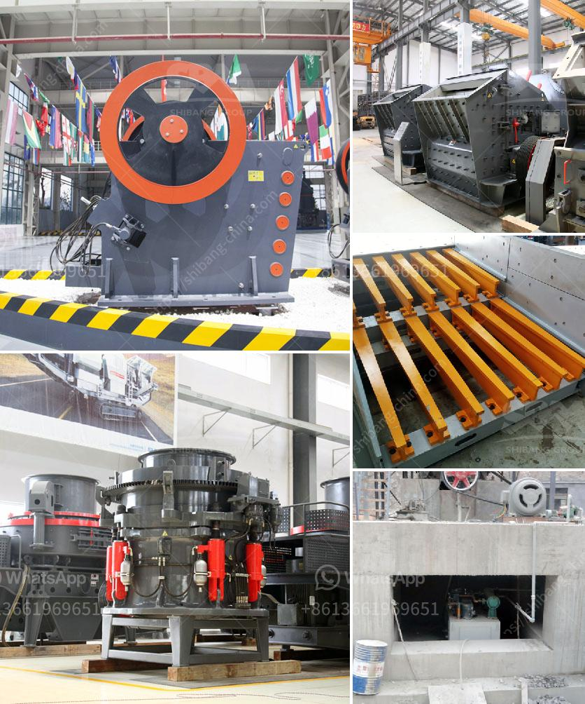

<h3>cone crusher manufacturers in france</h3>
When it comes to selecting a reliable cone crusher manufacturer in France, the choice can be challenging. Cone crushers are widely used in various industries, including mining, construction, and recycling. To choose the right cone crusher manufacturer, it is essential to consider factors such as production capacity, product quality, technical support, and after-sales service.

One of the key cone crusher manufacturers in France is Metso Minerals. Metso Minerals offers a wide range of cone crushers, including GP, HP, and MP series cone crushers. These crushers are designed for high performance and reliability, ensuring efficient crushing operations. Metso Minerals' cone crushers are known for their excellent cubicity, high reduction ratios, and consistent product shape.

Another prominent cone crusher manufacturer in France is FLSmidth. FLSmidth offers a comprehensive range of cone crushers, including Raptor cone crushers, which are designed to deliver high-performance crushing solutions. The Raptor cone crushers are known for their heavy-duty construction, durable components, and advanced automation features. These crushers are suitable for the most demanding applications, making them a preferred choice for many customers.

Thyssenkrupp is another renowned cone crusher manufacturer in France. Thyssenkrupp cone crushers are known for their rugged construction, reliable operation, and high productivity. These crushers are designed to handle a wide range of materials, including hard and abrasive ores, making them suitable for various applications. Thyssenkrupp offers a range of cone crusher models, such as Kubria and Gyratory crushers, designed for different crushing tasks.

Sandvik is also a well-known cone crusher manufacturer in France. Sandvik cone crushers are known for their advanced technology, innovative design, and high performance. Sandvik offers a wide range of cone crusher models, including HYDROCONE and CH, which are designed to meet the diverse needs of customers. These crushers are known for their excellent crushing efficiency and low operating costs, making them a preferred choice for many industries.

In addition to these major cone crusher manufacturers, there are also several smaller manufacturers in France. These manufacturers may specialize in specific types of cone crushers or cater to niche markets. It is important to thoroughly research and evaluate these manufacturers to ensure that their products meet your specific requirements.

When selecting a cone crusher manufacturer in France, it is crucial to consider not only the quality and performance of the crushers but also the technical support and after-sales service provided. A reliable manufacturer should offer comprehensive technical support, including installation assistance, training, and maintenance services. Additionally, a good manufacturer should provide prompt and efficient after-sales service to ensure uninterrupted operation and minimize downtime.

In conclusion, choosing a cone crusher manufacturer in France requires careful consideration of various factors, including production capacity, product quality, technical support, and after-sales service. Major manufacturers such as Metso Minerals, FLSmidth, Thyssenkrupp, and Sandvik offer a wide range of reliable cone crushers for various applications. However, it is equally important to research and evaluate smaller manufacturers to find a solution that best suits your specific needs.
<h3>Contact us</h3><ul><li><strong>Whatsapp:&nbsp;<a href="https://wa.me/8613661969651">+8613661969651</a></strong></li><li><a href="https://swt.shibang-china.com/?git&amp;zhl&amp;cone crusher manufacturers in france"><strong>Online Service(chat now)</strong></a></li></ul><h3>Related</h3><ul><li><a href='aggregate roller crushing mill malaysia.md'>aggregate roller crushing mill malaysia</a></li><li><a href='cost of 500 tpd cement plant india.md'>cost of 500 tpd cement plant india</a></li><li><a href='marble crusher equipment.md'>marble crusher equipment</a></li><li><a href='brick making business plan pdf.md'>brick making business plan pdf</a></li><li><a href='gold wash plant for sale canada.md'>gold wash plant for sale canada</a></li></ul>