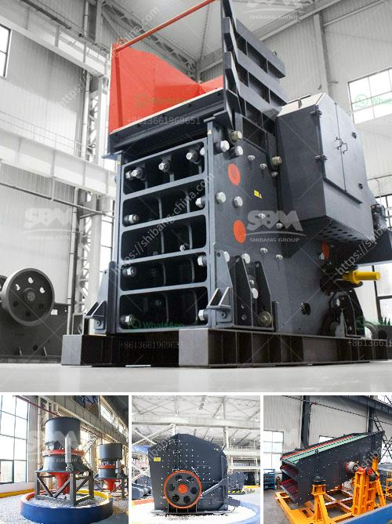

<h3>cone crusher price in china</h3>
The cone crusher is a versatile and powerful crushing machine that is used in many industries. Cone crushers are widely used in mining, smelting, building materials, highways, railways, water conservancy, and chemical industries to crush various ores and rocks of medium and medium hardness.

China has a large population and vast territory, and is rich in various mineral resources. With the rapid economic development, more and more industries require the use of cone crushers. As a result, the cone crusher market in China is very hot and competitive.

When it comes to the price of cone crushers, many people will think about several factors such as quality, performance, models, input size, output size, and capacity. These factors will affect the price of the equipment.

Firstly, the quality of the cone crusher is crucial. A high-quality cone crusher can ensure the stability and durability of the equipment, extend its service life, and reduce downtime and maintenance costs. Shanghai SBM Heavy Industry is a professional manufacturer of cone crushers. With more than 30 years of production experience, the company has strong technical force and advanced production technology, ensuring the quality and performance of the equipment.

Secondly, the models of cone crushers also affect the price. Different models have different processing capacities and output sizes. Generally, the larger the model, the higher the price. Customers should choose the appropriate model according to their specific needs.

Thirdly, the input size and output size of the material are also important factors affecting the price of cone crushers. Different cone crushers have different requirements for the size of the material. If the input size is too large or the output size is too large, a more powerful and higher-priced cone crusher is needed.

Lastly, the capacity of the cone crusher is also a factor that determines the price. The larger the capacity, the higher the price. Generally, cone crushers with larger processing capacities are more expensive. Customers should choose the appropriate capacity according to their actual production needs.

In conclusion, the cone crusher price in China is determined by a variety of factors such as quality, performance, models, input size, output size, and capacity. Customers should consider their own production needs and budget when choosing cone crushers. Shanghai SBM Heavy Industry is a reliable and professional cone crusher manufacturer. Its cone crushers have been exported to many countries and have won high praise from customers. If you are interested in cone crushers, you can contact us for more information.
<h3>Contact us</h3><ul><li><strong>Whatsapp:&nbsp;<a href="https://wa.me/8613661969651">+8613661969651</a></strong></li><li><a href="https://swt.shibang-china.com/?git&amp;zhl&amp;cone crusher price in china"><strong>Online Service(chat now)</strong></a></li></ul><h3>Related</h3><ul><li><a href='crusher stone crusher 1 ton peru.md'>crusher stone crusher 1 ton peru</a></li><li><a href='price of 500 tph stone crusher plant in malaysia.md'>price of 500 tph stone crusher plant in malaysia</a></li><li><a href='movable crushing plant.md'>movable crushing plant</a></li><li><a href='hard rock crushers.md'>hard rock crushers</a></li><li><a href='kaolin industry machine dhaka bangladesh.md'>kaolin industry machine dhaka bangladesh</a></li></ul>