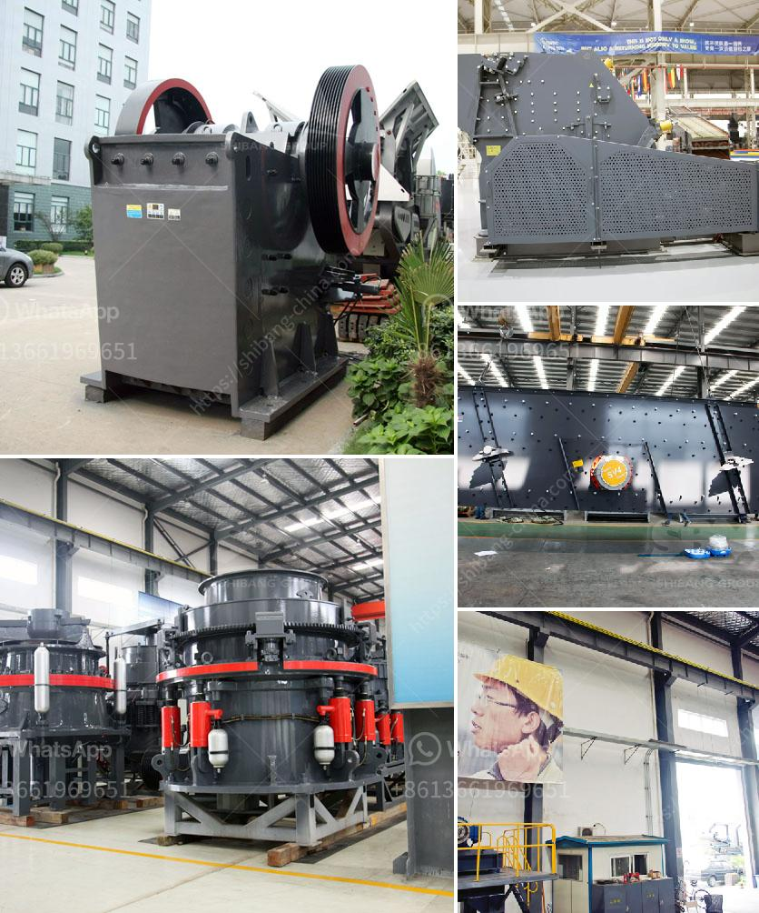

<h3>cone crusher supply</h3>
The cone crusher is a crushing machine designed to handle hard and abrasive materials. It has a long history of being an efficient and reliable machine in the mining industry. Cone crusher supply is currently in high demand due to its numerous advantages over other types of crushers such as jaw and gyratory crushers. Here, we will explore the cone crusher supply and its impact on the mining industry.

The cone crusher operates by squeezing the material between an eccentrically rotating mantle and a concave bowl. As the mantle rotates, it moves closer or further away from the concave, crushing the material into smaller pieces. This crushing action results in a more uniform product size with less fine material and a higher reduction ratio.

One of the main advantages of the cone crusher is its versatility. It can handle a wide range of materials, including hard and abrasive ones. This makes it suitable for various applications in the mining industry. Whether it is used for primary, secondary, or tertiary crushing, the cone crusher can efficiently process different types of rocks and minerals.

Another advantage of cone crusher supply is its high production capacity. The machine can handle large volumes of material, making it ideal for mining operations with high throughput requirements. Additionally, its robust design and durable components ensure a long lifespan, reducing downtime and maintenance costs.

Cone crusher supply also offers cost and energy savings. Compared to other types of crushers, the cone crusher consumes less energy per ton of material crushed. This results in lower operating costs and a reduced environmental footprint. Furthermore, the cone crusher's efficient crushing action minimizes the generation of fines, reducing the need for downstream processing and improving overall productivity.

The demand for cone crusher supply is driven by several factors. Firstly, the growth of the mining industry worldwide has increased the need for efficient crushing equipment. As mineral resources become more scarce and complex to extract, the demand for cone crushers capable of processing challenging materials and maximizing recovery rates rises.

Additionally, technological advancements in cone crusher design have made them more reliable and cost-effective. The introduction of hydraulic systems, automation, and advanced control systems has improved the performance and efficiency of cone crushers, further driving their demand.

Manufacturers and suppliers of cone crushers have been working to meet this growing demand. They are constantly innovating and developing new features to enhance the performance and reliability of their machines. Additionally, they provide comprehensive aftermarket support, including spare parts, maintenance, and technical assistance, to ensure the smooth operation of their products.

In conclusion, the cone crusher supply plays a crucial role in the mining industry. Its versatility, production capacity, cost and energy savings, and technological advancements make it an invaluable crushing machine. As the demand for efficient and reliable crushers continues to rise, manufacturers and suppliers are investing in research and development to meet the needs of the industry. The cone crusher is set to remain an essential tool in the mining industry for years to come.
<h3>Contact us</h3><ul><li><strong>Whatsapp:&nbsp;<a href="https://wa.me/8613661969651">+8613661969651</a></strong></li><li><a href="https://swt.shibang-china.com/?git&amp;zhl&amp;cone crusher supply"><strong>Online Service(chat now)</strong></a></li></ul><h3>Related</h3><ul><li><a href='jaw crushers liners.md'>jaw crushers liners</a></li><li><a href='stone crusher conveyor belts cost.md'>stone crusher conveyor belts cost</a></li><li><a href='raymond grinding mill europe.md'>raymond grinding mill europe</a></li><li><a href='types of equipments used in cement industry.md'>types of equipments used in cement industry</a></li><li><a href='bentonite processing plant in maharashtra.md'>bentonite processing plant in maharashtra</a></li></ul>