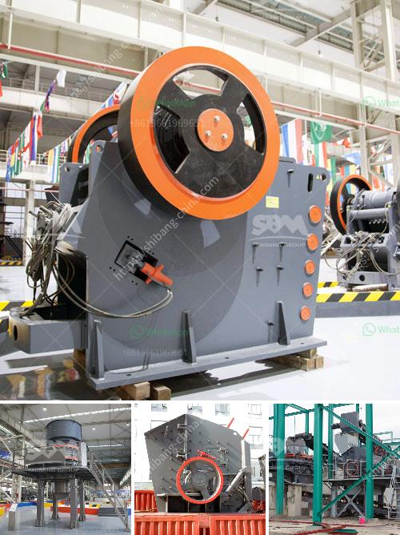

<h3>cone crusher working</h3>
The cone crusher is one of the most popular crushing machines on the market today. It is ideal for materials with a medium to high level of hardness and abrasiveness. As such, the cone crusher is commonly used in various fields like mining, metallurgy, building materials, and road construction.

In the cone crusher, the materials are crushed by two cones rotating against each other. The upper cone, which is called the mantle, rotates in the opposite direction to the lower cone, which is called the concave. This causes the materials to be squeezed and crushed between the mantle and concave.

The cone crusher works in a continuous rotation, so the materials impact and squeeze each other to achieve the crushing purpose. The material enters the crushing chamber from the upper part of the cone crusher and is discharged from the discharge port at the lower part of the crusher.

During the operation of the cone crusher, the motor drives the eccentric sleeve to rotate through the transmission device. The moving cone revolves under the action of the eccentric sleeve, and the material is crushed and squeezed in the crushing cavity.

The unique design of the cone crusher allows it to withstand high crushing forces and high-speed rotations, resulting in superior performance. It is also equipped with a hydraulic system that adjusts the size of the discharge opening, allowing for precise control over the final product size.

The cone crusher is known for its high efficiency and excellent performance. It not only improves the production capacity and crushing efficiency but also expands the scope of application. The materials that can be processed by the cone crusher include limestone, granite, basalt, quartzite, iron ore, and various hard and brittle materials.

Additionally, the cone crusher has the advantage of low operating costs, low energy consumption, and a long service life. It is designed with a reliable structure, high crushing efficiency, and excellent performance, making it a popular choice among users.

In conclusion, the cone crusher is a versatile and efficient crushing machine that plays a crucial role in many industries. Its unique design, high crushing capacity, and reliable performance make it an essential tool for any crushing operation. Whether it is used for mining, road construction, or building materials, the cone crusher is an excellent choice to meet the crushing needs of various applications.
<h3>Contact us</h3><ul><li><strong>Whatsapp:&nbsp;<a href="https://wa.me/8613661969651">+8613661969651</a></strong></li><li><a href="https://swt.shibang-china.com/?git&amp;zhl&amp;cone crusher working"><strong>Online Service(chat now)</strong></a></li></ul><h3>Related</h3><ul><li><a href='carbon grinding machine.md'>carbon grinding machine</a></li><li><a href='aggregate crushing plant sale.md'>aggregate crushing plant sale</a></li><li><a href='grinding ball mill equipment.md'>grinding ball mill equipment</a></li><li><a href='how much investment needed to start a crusher in canada.md'>how much investment needed to start a crusher in canada</a></li><li><a href='cocoa processing plant in india.md'>cocoa processing plant in india</a></li></ul>