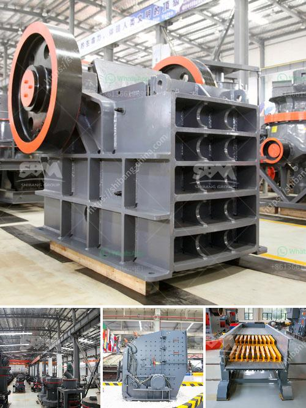

<h3>cone crushers south africa</h3>
When it comes to crushing materials, there is no better choice than cone crushers in South Africa. These versatile crushers can handle a wide variety of materials, ranging from limestone to basalt. They are also extremely efficient and can produce a high-quality end product with minimal energy consumption.

One of the key advantages of cone crushers is their ability to crush hard, abrasive rocks. This makes them ideal for use in mining and quarrying applications, where the ore or rock is often quite challenging to break down. Cone crushers use an eccentrically rotating cone to compress the material between a mantle and concave. This action breaks the rock or ore into smaller pieces, which can then be further processed or used as is.

In South Africa, cone crushers are often found in coastal and riverbed environments, as these areas tend to have a higher percentage of abrasive rocks. These environments require crushers that are durable, efficient, and capable of handling the challenges presented by the natural materials found there.

Cone crushers in South Africa are also designed to be easy to maintain and service, which helps to reduce downtime and keep the crusher operating at peak performance. Many of these features are similar to those found in larger crushers, so the transition from a jaw crusher or impact crusher to a cone crusher in South Africa is seamless.

In addition to its advantages, cone crushers in South Africa also have their limitations. These crushers are typically limited in capacity and are not suitable for high-volume crushing tasks. With a smaller feed size and limited throughput capacity, cone crushers are not ideal for large-scale operations.

Despite these limitations, cone crushers in South Africa still have a wide range of applications. They are often used as secondary or tertiary crushers in areas where the primary crusher cannot handle the material. For example, cone crushers are commonly used in small-scale mining operations where the rocks are not as abrasive.

Another application for cone crushers in South Africa is in the construction industry. These crushers are often used in road construction projects, where they can crush and shape aggregates to create a smooth and durable surface. Cone crushers are also used in infrastructure projects, such as the construction of bridges and dams, where the demand for high-quality materials is essential.

Overall, cone crushers in South Africa are an essential resource for the country's mining and construction industries. These crushers offer numerous benefits, including their ability to handle various materials, their efficiency, and easy maintenance. While they may have limitations in terms of capacity, cone crushers are still a reliable and versatile choice for crushing applications in South Africa.
<h3>Contact us</h3><ul><li><strong>Whatsapp:&nbsp;<a href="https://wa.me/8613661969651">+8613661969651</a></strong></li><li><a href="https://swt.shibang-china.com/?git&amp;zhl&amp;cone crushers south africa"><strong>Online Service(chat now)</strong></a></li></ul><h3>Related</h3><ul><li><a href='mica powder machine.md'>mica powder machine</a></li><li><a href='sand screen machine.md'>sand screen machine</a></li><li><a href='stone crusher machine for hire in mpumalanga.md'>stone crusher machine for hire in mpumalanga</a></li><li><a href='ball mill for silica sand.md'>ball mill for silica sand</a></li><li><a href='ball mill suppliers china.md'>ball mill suppliers china</a></li></ul>