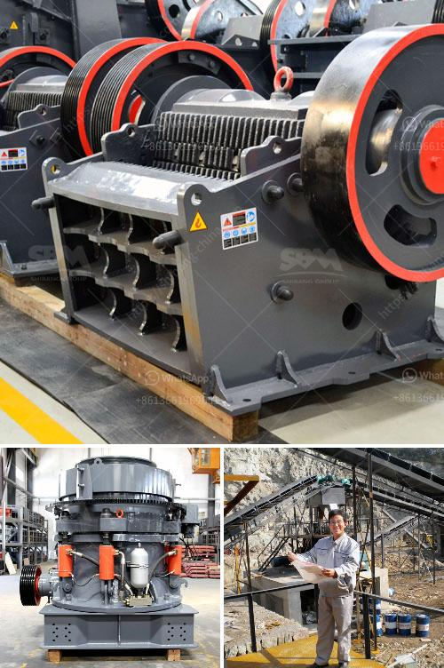

<h3>cone crushers supplier mining</h3>
Mining operations require a large amount of machinery and equipment that perform a variety of tasks on-site. Amongst this machinery, cone crushers are often used as a key piece of equipment for mining operations. Cone crushers are capable of crushing large rocks into smaller particles by way of an eccentrically rotating spindle. This allows for the efficient extraction of minerals from the ore.

Choosing the right cone crusher supplier for mining operations is crucial to the success of any mining project. The supplier should have extensive experience in the industry and be able to provide quality equipment that meets the specific needs of the operation. Additionally, they should offer ongoing support and after-sales service to ensure the smooth running of the mining operation.

A reputable cone crusher supplier will have a range of cone crushers available to suit different mining needs. Some cone crushers are more suitable for crushing hard rocks, while others are more suited to softer materials. The supplier should be able to advise on the best type of cone crusher for a specific mining operation.

In addition to the right equipment, a reliable cone crusher supplier should also provide efficient maintenance and repair services. Cone crushers can experience wear and tear over time, so it's essential to have a supplier that can quickly address any maintenance or repair issues. This will minimize downtime and keep the mining operation running smoothly.

When selecting a cone crusher supplier for mining, it's important to consider the supplier's reputation and track record. This can be done by reading customer reviews and testimonials, as well as checking references provided by the supplier. A reputable supplier will have a solid reputation in the industry and a history of providing reliable equipment and services.

Overall, cone crushers are a critical piece of equipment in the mining industry, and choosing the right supplier is crucial to the success of mining operations. With the right supplier, mining companies can ensure the efficient extraction of minerals and the smooth running of their operations.
<h3>Contact us</h3><ul><li><strong>Whatsapp:&nbsp;<a href="https://wa.me/8613661969651">+8613661969651</a></strong></li><li><a href="https://swt.shibang-china.com/?git&amp;zhl&amp;cone crushers supplier mining"><strong>Online Service(chat now)</strong></a></li></ul><h3>Related</h3><ul><li><a href='chinese ore processing plants.md'>chinese ore processing plants</a></li><li><a href='ball mill ghana in zambia.md'>ball mill ghana in zambia</a></li><li><a href='grinding calcium carbonate equipment.md'>grinding calcium carbonate equipment</a></li><li><a href='industrial application of ball mills.md'>industrial application of ball mills</a></li><li><a href='sand manufacturing small scale.md'>sand manufacturing small scale</a></li></ul>