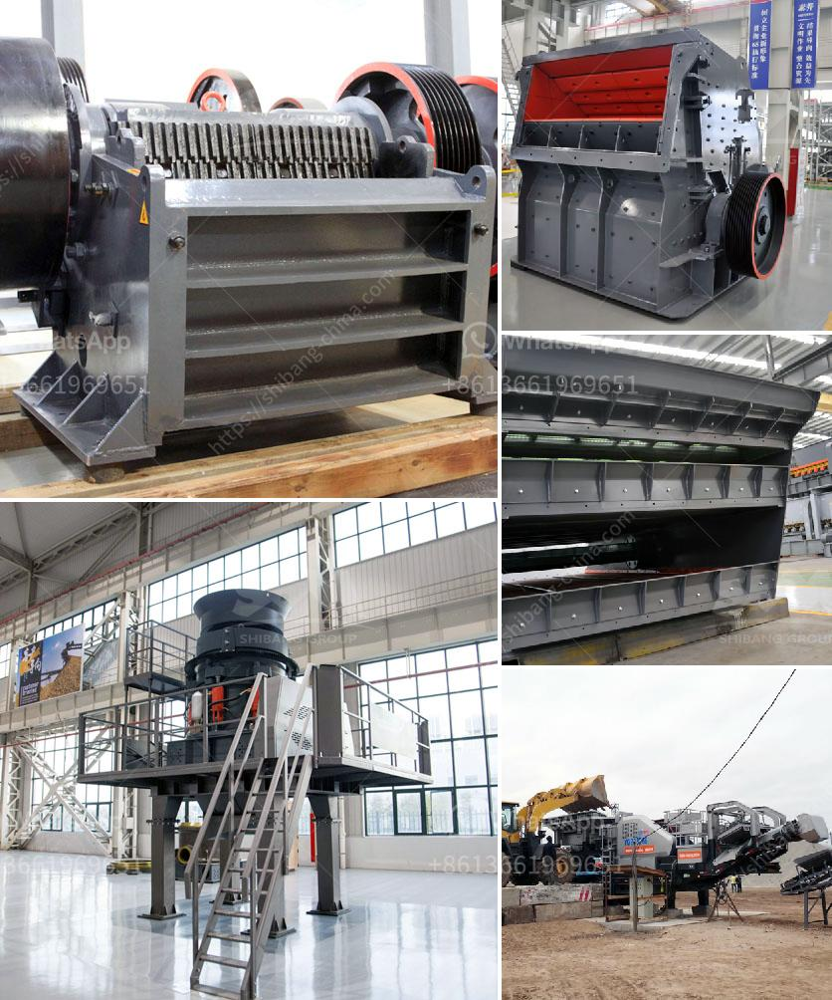

<h3>construction material recycling</h3>
In today's fast-paced world, it's becoming increasingly important to adopt sustainable practices in every aspect of our lives, including the construction industry. Construction material recycling, a process that involves the recovery and reuse of materials from demolished or renovated structures, is one such sustainable practice gaining popularity. Not only does it reduce waste and minimize environmental impact, but it also offers economic benefits and presents innovative opportunities for the construction sector.

The construction industry has long been notorious for the amount of waste it generates. Unfortunately, a significant portion of construction and demolition waste ends up in landfill sites, contributing to pollution and depleting precious natural resources. However, with the growing adoption of construction material recycling, we can mitigate these adverse effects and pave the way for a more sustainable future.

One of the primary advantages of construction material recycling is the reduction in waste generation. By reusing and repurposing materials, we can divert tons of construction and demolition waste from landfills. This not only helps in conserving landfill space but also prevents the release of harmful substances into the environment, such as heavy metals and toxic chemicals present in certain construction materials.

Additionally, construction material recycling offers economic benefits to both the construction industry and society as a whole. Recycling materials reduces the need for new resource extraction, lowering the costs associated with acquiring raw materials. This, in turn, can lead to more affordable construction projects for individuals and communities. Moreover, recycling creates jobs in the waste management and recycling sectors, contributing to local economic growth.

The scope for innovation and creativity in the construction industry is vast when it comes to recycling materials. Numerous construction companies and architects are now exploring innovative ways to incorporate recycled materials into their projects. From reclaimed wood for flooring to old bricks for constructing walls, the possibilities are endless. Not only does this promote sustainability, but it also adds a unique aesthetic value to the built environment.

To effectively implement construction material recycling, collaboration and awareness among stakeholders are vital. Governments, construction companies, architects, and homeowners need to work together to ensure the proper sorting, collection, and processing of construction waste. Creating awareness about the benefits and importance of recycling among construction professionals and the general public is also crucial.

While construction material recycling has tremendous potential, it does come with its challenges. Sorting and processing construction waste can be a labor-intensive task, requiring specialized equipment and skilled labor. Moreover, not all materials are easily recyclable, and certain construction practices may inhibit the recycling process. However, these challenges can be overcome through research, innovation, and improved waste management practices.

In conclusion, construction material recycling is a crucial component of building a sustainable future. By reducing waste generation, conserving resources, and promoting job creation, it offers both environmental and economic benefits. Embracing recycling practices in the construction industry not only helps protect the environment but also inspires innovation and creativity. With collaboration and awareness, we can transform the construction sector into a sustainable force, creating a better world for future generations.
<h3>Contact us</h3><ul><li><strong>Whatsapp:&nbsp;<a href="https://wa.me/8613661969651">+8613661969651</a></strong></li><li><a href="https://swt.shibang-china.com/?git&amp;zhl&amp;construction material recycling"><strong>Online Service(chat now)</strong></a></li></ul><h3>Related</h3><ul><li><a href='components for cone crusher major.md'>components for cone crusher major</a></li><li><a href='calcium oxide powder grinders.md'>calcium oxide powder grinders</a></li><li><a href='crusher machine plant estimation cost.md'>crusher machine plant estimation cost</a></li><li><a href='second hand ball mill and gauteng.md'>second hand ball mill and gauteng</a></li><li><a href='price of zenith jaw crusher.md'>price of zenith jaw crusher</a></li></ul>