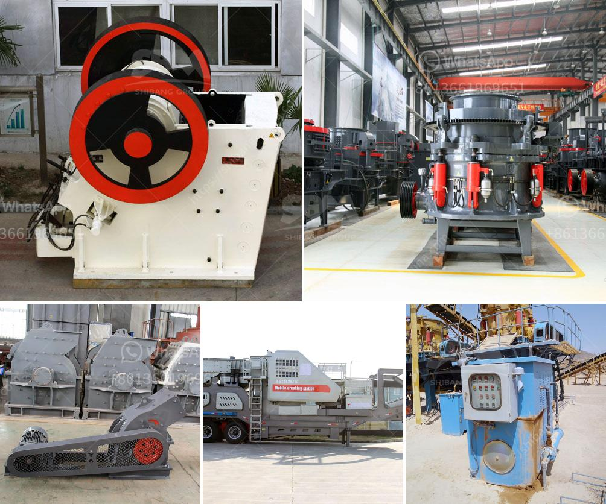

<h3>contact list of mining companies in germany</h3>
Germany has a rich mining history that dates back centuries, and even though the industry has experienced a decline in recent years, it still remains a significant contributor to the country's economy. Whether it's extracting coal, minerals, or other valuable resources, numerous mining companies operate in Germany. In this article, we will explore some prominent mining companies and provide a comprehensive contact list for those interested in exploring business opportunities within the German mining sector.

A prime player in the mining industry, RAG AG specializes in coal extraction and processing. With their headquarters in Essen, RAG AG encompasses several subsidiary companies involved in coal mining, coke production, and waste management. They have a rich expertise in mining operations, mine safety, as well as environmental protection. For inquiries or partnerships, interested individuals can reach out to them via their website or directly contacting their headquarters.

K+S AG is one of the leading salt and potash producers worldwide. With a focus on the extraction and processing of these valuable minerals, K+S AG has multiple mines across Germany, including Werra, Zielitz, and Hattorf. Their product portfolio extends to agricultural and industrial applications. For business inquiries or more information, interested parties can utilize the contact information provided on their website.

Aurubis AG is a major copper producer, primarily specializing in the recycling and processing of copper and precious metals. Operating in several countries, including Germany, Aurubis AG offers a range of copper products, recycling services, and industrial solutions. For more information or business partnerships, their website provides detailed contact information.

DSK is another prominent mining company in Germany, specifically engaged in hard coal extraction and processing. Their focus is on maintaining a sustainable coal industry while ensuring the highest safety standards. Those interested in collaborating with DSK can find their contact information on their official website.

Wismut GmbH is a German-Russian joint venture engaged in uranium mining in Germany. Although the company is primarily involved in dealing with the legacy of uranium mining, they still manage active mining operations in Saxony and Thuringia. For inquiries regarding Wismut GmbH's activities or other matters, interested parties can make use of the available contact information on their website.

The mining industry in Germany continues to play a significant role despite its decline in recent years. The aforementioned mining companies showcase the diverse range of mineral resources being extracted and processed within the country. Establishing fruitful partnerships, expanding one's business interests, or seeking collaboration opportunities within the German mining sector is made easier with the detailed contact information provided by these prominent companies.
<h3>Contact us</h3><ul><li><strong>Whatsapp:&nbsp;<a href="https://wa.me/8613661969651">+8613661969651</a></strong></li><li><a href="https://swt.shibang-china.com/?git&amp;zhl&amp;contact list of mining companies in germany"><strong>Online Service(chat now)</strong></a></li></ul><h3>Related</h3><ul><li><a href='tata stone crusher machines.md'>tata stone crusher machines</a></li><li><a href='three roller mill pakistan.md'>three roller mill pakistan</a></li><li><a href='used asphalt plants for sale in japan.md'>used asphalt plants for sale in japan</a></li><li><a href='cocoa processing plant in india.md'>cocoa processing plant in india</a></li><li><a href='stone crusher machine for hire in mpumalanga.md'>stone crusher machine for hire in mpumalanga</a></li></ul>