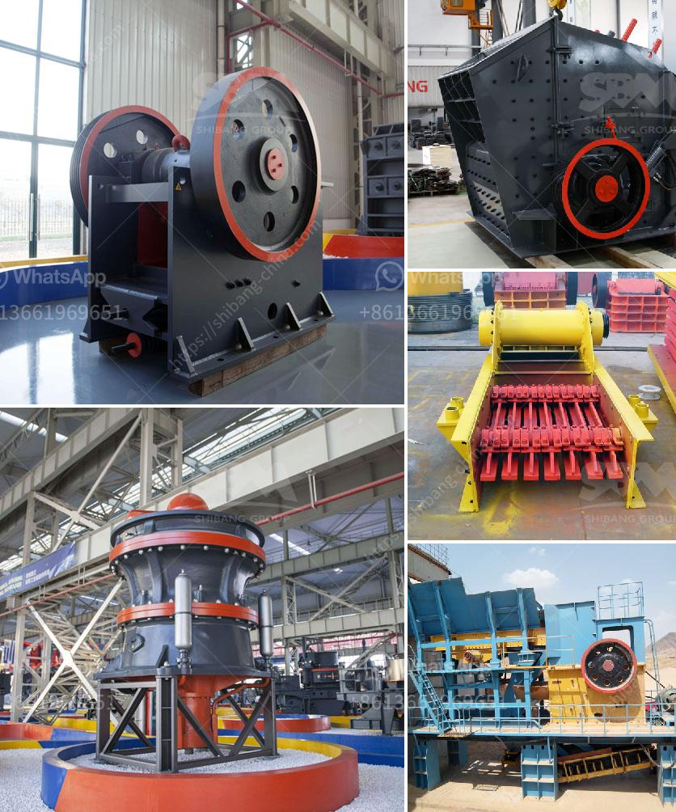

<h3>conveyor belt manufactuer zimbabwe</h3>
Zimbabwe, a landlocked country located in Southern Africa, is known for its diversified economy encompassing agriculture, mining, and manufacturing industries. In this rapidly growing industrial sector, the demand for efficient and reliable material handling equipment has become crucial. Among the various equipment types, conveyor belts play a vital role in streamlining production processes and enhancing overall efficiency. Therefore, the presence of a conveyor belt manufacturer in Zimbabwe becomes imperative to meet the industry's needs.

Conveyor belts are widely used in different industries, such as mining, agriculture, food processing, and construction, to transport or move materials from one place to another. A conveyor belt manufacturer in Zimbabwe offers a wide range of conveyor belts designed for different applications, ensuring smooth and seamless material handling. These manufacturers understand the need for customized solutions and provide conveyor belts that can withstand harsh environmental conditions, extreme temperatures, and heavy loads.

One of the key advantages of having a conveyor belt manufacturer in Zimbabwe is the provision of locally produced equipment, which reduces lead times and overall costs. Importing conveyor belts from international suppliers can lead to delays and increased expenses due to transportation and customs. Hence, relying on a local manufacturer ensures a consistent supply of high-quality conveyor belts within short notice, minimizing production downtimes.

Furthermore, working with a conveyor belt manufacturer in Zimbabwe allows businesses to benefit from their expertise and experience. These manufacturers understand the unique challenges faced by local industries and can provide tailored solutions to improve productivity and efficiency. They also offer services such as installation, maintenance, and repairs, ensuring that the conveyor belts continue to function optimally throughout their lifespan.

In conclusion, having a conveyor belt manufacturer in Zimbabwe is essential for the country's thriving industrial sector. These manufacturers provide high-quality, locally produced conveyor belts that meet the diverse needs of various industries. By enhancing efficiency and productivity, conveyor belts contribute significantly to the growth and development of Zimbabwe's economy.
<h3>Contact us</h3><ul><li><strong>Whatsapp:&nbsp;<a href="https://wa.me/8613661969651">+8613661969651</a></strong></li><li><a href="https://swt.shibang-china.com/?git&amp;zhl&amp;conveyor belt manufactuer zimbabwe"><strong>Online Service(chat now)</strong></a></li></ul><h3>Related</h3><ul><li><a href='cost of starting a quarry business.md'>cost of starting a quarry business</a></li><li><a href='cement clinker conveyor belt.md'>cement clinker conveyor belt</a></li><li><a href='cost of crusher machine kenya.md'>cost of crusher machine kenya</a></li><li><a href='looking for a partner for machinery crusher.md'>looking for a partner for machinery crusher</a></li><li><a href='how does a stone crusher plant operate.md'>how does a stone crusher plant operate</a></li></ul>