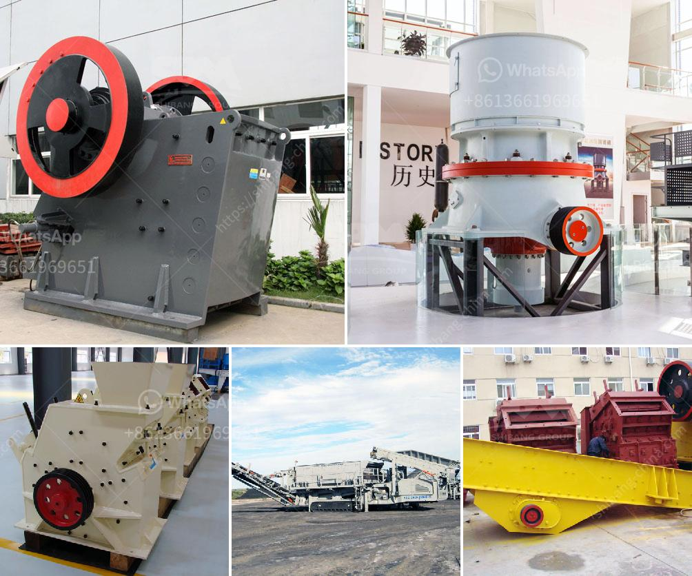

<h3>conveyor belting manufacturers</h3>
Conveyor belts have become an integral part of various industries, from manufacturing to mining, agriculture to logistics. These belts not only facilitate the movement of goods and materials but also significantly enhance operational efficiency. Behind these exceptional tools are conveyor belting manufacturers, who are continuously innovating and providing high-quality products to meet the industry's evolving needs.

One notable aspect of conveyor belting manufacturers is their commitment to efficiency and automation. They understand that businesses today are relentlessly striving to optimize their operations and reduce costs. As a result, conveyor belts have transformed dramatically over the years, with advanced technologies being integrated to streamline processes.

A key advantage of conveyor belts is their ability to handle large volumes of materials with minimal human intervention. This is made possible by the manufacturers who design and develop belts capable of withstanding hefty loads, operating at high speeds, and enduring various environmental conditions. Moreover, by incorporating sensors and control systems, these manufacturers have enabled conveyor belts to automatically adjust their speed, detect anomalies, and enhance the overall workflow efficiency.

Another area in which conveyor belting manufacturers excel is their dedication to safety. Conveyor belts pose potential hazards, such as entanglements and jams, which can lead to accidents or damage to products. To mitigate these risks, manufacturers adhere to strict safety standards and utilize innovative safety features. Emergency stop systems, guarding mechanisms, and advanced monitoring technologies are some examples of initiatives taken by manufacturers to ensure safe working conditions.

Conveyor belting manufacturers also play a crucial role in sustainability efforts across industries. With growing concerns about environmental impact, manufacturers have been actively engaged in developing belts made from recyclable materials and adopting energy-efficient techniques. By embracing sustainable practices, such as reducing carbon emissions and minimizing waste, manufacturers contribute to a greener future.

Additionally, conveyor belting manufacturers provide extensive support to industries through their comprehensive services. They offer customized solutions tailored to specific requirements, including belt fabrication, installation, and maintenance. Moreover, manufacturers assist clients in selecting the right belt type based on factors like material properties, load weight, and operating conditions. With their in-depth knowledge and experience, manufacturers ensure optimal belt performance and minimize downtime.

Considering the diverse applications of conveyor belts, manufacturers continuously strive to develop specialized belts for specific industries. For instance, food-grade belts are designed to meet strict hygiene standards in the food and beverage sector, while flame-resistant belts are essential for industries handling flammable materials. By catering to unique industry needs, conveyor belting manufacturers contribute to the seamless flow of operations across various sectors.

In conclusion, conveyor belting manufacturers are at the forefront of revolutionizing industries through automation, efficiency, and safety. Their continuous efforts in innovation and sustainability have transformed conveyor belts into indispensable tools for businesses today. As the demand for faster and more reliable material handling increases, these manufacturers play a vital role in shaping the future of industrial automation and logistics. With their expertise and dedication, conveyor belting manufacturers pave the way for enhanced productivity, reduced costs, and a safer working environment.
<h3>Contact us</h3><ul><li><strong>Whatsapp:&nbsp;<a href="https://wa.me/8613661969651">+8613661969651</a></strong></li><li><a href="https://swt.shibang-china.com/?git&amp;zhl&amp;conveyor belting manufacturers"><strong>Online Service(chat now)</strong></a></li></ul><h3>Related</h3><ul><li><a href='gypsum import from bhutan.md'>gypsum import from bhutan</a></li><li><a href='mining and quarrying crusher machinery and equipment.md'>mining and quarrying crusher machinery and equipment</a></li><li><a href='stone crusher mini.md'>stone crusher mini</a></li><li><a href='primary crushers.md'>primary crushers</a></li><li><a href='rock sand making machine.md'>rock sand making machine</a></li></ul>