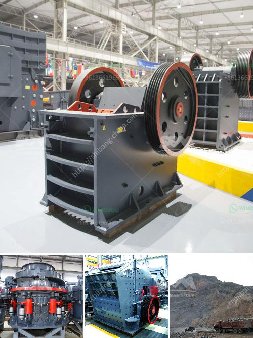

<h3>conveyor belts equipment in gauteng</h3>
Conveyor belts play a significant role in many industries, facilitating the efficient movement of goods and materials across production lines. In Gauteng, a province in South Africa known for its vibrant industrial sector, the demand for conveyor belts and related equipment has been growing steadily.

One of the primary benefits of conveyor belts is their ability to reduce manual labor and streamline operations. By automating the transportation of goods, these belts enhance efficiency, productivity, and overall safety in various industries. From manufacturing plants to warehouses and distribution centers, conveyor belts in Gauteng have become an indispensable asset.

The industrial sector in Gauteng relies on conveyor belts to transport a wide range of materials. From raw materials like ores, coal, and aggregates to finished products such as cars, electrical appliances, and packaged goods, these belts ensure a smooth flow of production. By eliminating manual handling and reducing the risk of damage to the materials during transportation, conveyor belts contribute to improved product quality.

Conveyor belts in Gauteng are available in various sizes, designs, and capacities to suit the specific needs of different industries. Additionally, advanced features such as automated controls, variable speed drives, and sorting systems further enhance their functionality.

With the rapid advancement in technology, the conveyor belt industry in Gauteng has witnessed innovations like modular belts, magnetic conveyors, and telescopic conveyors. These advancements enable industries to customize conveyor systems and adapt them to their unique operational requirements.

Furthermore, conveyor belt equipment in Gauteng is complemented by a range of accessories and components like conveyor rollers, idlers, and belt fasteners. These accessories help ensure optimal performance, extend the lifespan of the belts, and minimize downtime due to maintenance or repairs.

In conclusion, conveyor belts and related equipment have become integral to the industrial landscape in Gauteng. Their ability to increase efficiency, optimize operations, and ensure the smooth flow of materials has made them a staple in various sectors. As technology continues to advance, it is anticipated that the conveyor belt industry in Gauteng will further evolve to meet the growing demands of the region's industrial sector.
<h3>Contact us</h3><ul><li><strong>Whatsapp:&nbsp;<a href="https://wa.me/8613661969651">+8613661969651</a></strong></li><li><a href="https://swt.shibang-china.com/?git&amp;zhl&amp;conveyor belts equipment in gauteng"><strong>Online Service(chat now)</strong></a></li></ul><h3>Related</h3><ul><li><a href='gypsum powder machine.md'>gypsum powder machine</a></li><li><a href='concrete stone making machine south africa.md'>concrete stone making machine south africa</a></li><li><a href='nigeria stone crusher.md'>nigeria stone crusher</a></li><li><a href='granite crushing production line.md'>granite crushing production line</a></li><li><a href='i need a second hand mobile stone crusher south africa.md'>i need a second hand mobile stone crusher south africa</a></li></ul>