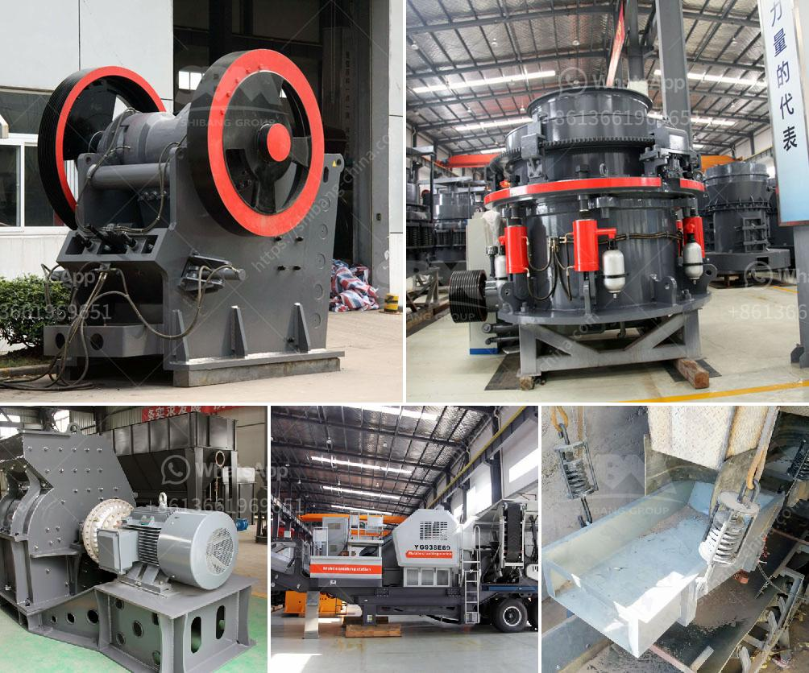

<h3>conveyor belts philippine price</h3>
Conveyor belts play a vital role in various industries, particularly in manufacturing and logistics. These technological marvels efficiently move materials and products from one area to another, ensuring a smooth and uninterrupted workflow. In the Philippines, the demand for conveyor belts is steadily increasing, leading to a growing market for these essential equipment.

When it comes to purchasing conveyor belts in the Philippines, one of the main considerations for both buyers and businesses is the price. Getting the best value for money is crucial in today's competitive market. However, it is essential to remember that the price should not be the sole factor in choosing the conveyor belt for your needs.

In the Philippines, conveyor belt prices can range from as low as PHP 8,000 to PHP 30,000 per meter. However, keep in mind that the quality and specifications of the belt will greatly influence the price point. Different industries have varying requirements, such as the type of material to be conveyed, the distance it needs to travel, and the weight it must support. All these factors contribute to the overall cost of the conveyor belt.

It is advisable to invest in a conveyor belt that meets your specific requirements and offers long-term durability. Choose a belt that can withstand the demands of your industry, as this will ensure minimal downtime and maintenance costs. Additionally, consider the reputation and credibility of the conveyor belt supplier or manufacturer. An established company will offer quality products with warranties and after-sales support, providing peace of mind to the buyer.

In conclusion, purchasing conveyor belts in the Philippines requires careful consideration of both the price and quality. While there is a wide range of prices available in the market, it is important to focus on reliability, durability, and compatibility with your industry's requirements. By choosing the right conveyor belt, businesses can streamline their processes, reduce downtime, and ultimately achieve higher productivity and profitability.
<h3>Contact us</h3><ul><li><strong>Whatsapp:&nbsp;<a href="https://wa.me/8613661969651">+8613661969651</a></strong></li><li><a href="https://swt.shibang-china.com/?git&amp;zhl&amp;conveyor belts philippine price"><strong>Online Service(chat now)</strong></a></li></ul><h3>Related</h3><ul><li><a href='copper ore concentrator price.md'>copper ore concentrator price</a></li><li><a href='mineral ball mill.md'>mineral ball mill</a></li><li><a href='what is the feed of jaw crusher.md'>what is the feed of jaw crusher</a></li><li><a href='rock crusher gravel production.md'>rock crusher gravel production</a></li><li><a href='trommel ball mill.md'>trommel ball mill</a></li></ul>