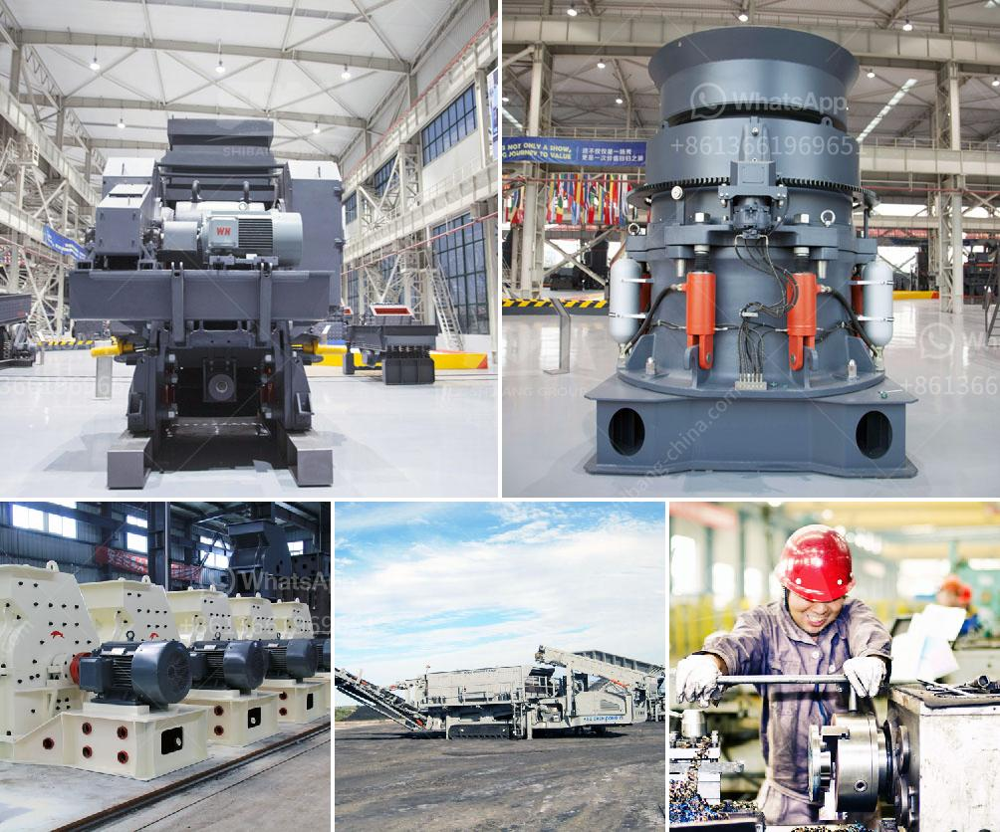

<h3>conveyor equipment in tanzania</h3>
The industrial sector in Tanzania has been witnessing significant growth in recent years, driven by various factors such as increased manufacturing activities, a surge in domestic and international trade, and the country's efforts to become an industrialized nation. One crucial aspect that has played a pivotal role in supporting this growth is the use of conveyor equipment. These systems have proved to be indispensable in streamlining operations, enhancing productivity, and ensuring efficient material handling across industries.

Conveyor equipment refers to machines or devices designed to move materials and products from one point to another within a facility or production line. It eliminates the need for manual labor, allowing for faster and more consistent handling of goods. In Tanzania, this technology has been widely adopted by a diverse range of industries, including mining, agriculture, manufacturing, and logistics.

In the mining sector, conveyor systems are extensively used to transport minerals, ores, and other raw materials from the pits to processing or storage areas. These systems not only improve operational efficiency but also enhance worker safety by reducing the risks associated with heavy lifting and manual material handling. The use of conveyors has enabled mining companies in Tanzania to increase their production capacity and meet the growing demand for minerals both domestically and internationally.

In the agricultural sector, conveyor equipment has revolutionized the handling and processing of crops such as coffee, tea, and cereals. By automating tasks such as sorting, grading, and packaging, these systems have improved the overall productivity and quality of agricultural products. Farmers and agribusinesses in Tanzania are now able to efficiently process and transport their produce, minimizing losses and maximizing profitability.

The manufacturing industry in Tanzania has also benefited significantly from the integration of conveyor systems. These systems facilitate the seamless movement of goods between different stages of the production process, enabling a smooth workflow and reducing production time. Whether it is automotive assembly lines, food processing plants, or packaging units, conveyor equipment has become an indispensable asset for manufacturers in Tanzania, allowing them to meet market demands efficiently.

Furthermore, the logistics and distribution sector in Tanzania heavily relies on conveyor equipment to ensure the seamless movement of goods within warehouses, cargo terminals, and transportation hubs. These systems enable the efficient loading and unloading of trucks, containers, and railcars, minimizing handling time and optimizing storage capacity. By improving supply chain operations, conveyor systems have contributed to reducing operational costs and enhancing the overall competitiveness of businesses in the country.

While the adoption of conveyor equipment in Tanzania has brought numerous benefits, it is important to address some challenges associated with its implementation. These include the initial capital investment required, maintenance costs, and the need for skilled technicians to operate and maintain the systems. To overcome these challenges, the government, in collaboration with private stakeholders, should focus on providing financial incentives, training programs, and technical support to encourage the wider adoption of conveyor technology across industries.

In conclusion, conveyor equipment has emerged as a game-changer in Tanzania, contributing to the country's industrial growth and economic development. Its widespread use has led to improved productivity, reduced operational costs, enhanced worker safety, and overall efficiency in material handling processes. As Tanzania continues to forge ahead on its path to becoming an industrialized nation, the integration of conveyor systems should be prioritized to further boost the country's industrial capabilities and competitiveness.
<h3>Contact us</h3><ul><li><strong>Whatsapp:&nbsp;<a href="https://wa.me/8613661969651">+8613661969651</a></strong></li><li><a href="https://swt.shibang-china.com/?git&amp;zhl&amp;conveyor equipment in tanzania"><strong>Online Service(chat now)</strong></a></li></ul><h3>Related</h3><ul><li><a href='mobile screen machine.md'>mobile screen machine</a></li><li><a href='south africa ballast crushing companies.md'>south africa ballast crushing companies</a></li><li><a href='beneficios de una chancadora conica.md'>beneficios de una chancadora conica</a></li><li><a href='stone jaw crusher.md'>stone jaw crusher</a></li><li><a href='cost of starting a quarry business.md'>cost of starting a quarry business</a></li></ul>