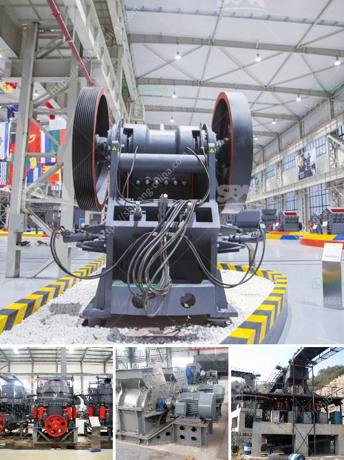

<h3>conveyor systems for sand and gravel</h3>
Sand and gravel deposits are abundant and widespread across the globe. With a growing population and increasing urbanization, extracting these valuable resources is crucial for construction and infrastructure development. However, the extraction and transportation of sand and gravel can be challenging and time-consuming without the right equipment and systems in place. This is where conveyor systems come in, offering a practical and efficient solution for material handling in the sand and gravel industry.

One of the main advantages of using conveyor systems for sand and gravel is the ability to move large quantities of material quickly and safely. With the ability to convey material at steep inclines or even vertically, conveyor systems can also eliminate the need for costly and time-consuming hauling vehicles, reducing labor and operating costs significantly. From the extraction site to the processing plant and finally to the stockyard, conveyor systems ensure a smooth and continuous flow of material, maximizing productivity and minimizing downtime.

Another key benefit of conveyor systems is their flexibility and adaptability to suit specific project requirements. Whether it's a short-distance transport within a quarry or a long-haul journey to a construction site, conveyors can be customized to meet varying material handling needs. From belt conveyors to screw conveyors and bucket elevators, each type of conveyor system offers unique features and advantages, allowing for efficient and tailored handling of sand and gravel.

Furthermore, conveyor systems contribute to environmental sustainability by reducing carbon emissions and minimizing the disturbance of fragile ecosystems. With advanced technologies and design improvements, conveyor systems have become more energy-efficient and environmentally friendly. Additionally, by minimizing the need for constant vehicle movements and reducing traffic congestion, conveyors help in mitigating the negative impacts of sand and gravel extraction on local communities and wildlife.

In conclusion, conveyor systems have revolutionized the sand and gravel industry by offering a cost-effective, efficient, and environmentally friendly solution for material handling. From improved productivity and reduced labor costs to the conservation of natural resources and sustainability, the benefits of using conveyors in this industry are undeniable. As the demand for sand and gravel continues to rise, investing in conveyor systems is a wise choice for companies looking to stay competitive while minimizing their environmental footprint.
<h3>Contact us</h3><ul><li><strong>Whatsapp:&nbsp;<a href="https://wa.me/8613661969651">+8613661969651</a></strong></li><li><a href="https://swt.shibang-china.com/?git&amp;zhl&amp;conveyor systems for sand and gravel"><strong>Online Service(chat now)</strong></a></li></ul><h3>Related</h3><ul><li><a href='mode of oeration of a gyratory crusher.md'>mode of oeration of a gyratory crusher</a></li><li><a href='crusher machine in gujranwala location.md'>crusher machine in gujranwala location</a></li><li><a href='how to start a sand mining business in south africa.md'>how to start a sand mining business in south africa</a></li><li><a href='ore wash plant for sale.md'>ore wash plant for sale</a></li><li><a href='mtm 160 mill spare parts suppliers in india.md'>mtm 160 mill spare parts suppliers in india</a></li></ul>