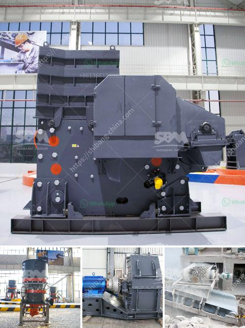

<h3>copper concentrate plant equipment list</h3>
A copper concentrate plant requires various equipment to ensure the smooth functioning of its operations. These equipment are essential for the processing of copper ore and extracting purified copper from them. Here, we will explore the equipment list necessary for a copper concentrate plant.

Crushers are used to break down large copper ore rocks into smaller, more manageable sizes. Jaw crushers, cone crushers, and impact crushers are commonly used crushing equipment in copper concentrate plants. These machines reduce the size of the copper ore to facilitate easier transportation and storage.

After the crushing process, grinding equipment is used to further reduce the size of the copper ore particles. This equipment helps in the liberation of minerals from the ore, enabling easier separation. Ball mills and rod mills are commonly used grinding equipment in copper concentrate plants.

Flotation is a crucial process in extracting copper from the ore. Flotation equipment helps separate valuable minerals from unwanted impurities. Froth flotation cells, flotation columns, and flotation machines are commonly used in copper concentrate plants. These equipment use chemical reagents and air bubbles to separate minerals from the ore.

Once the copper ore is separated from impurities, thickening and filtering equipment are used to concentrate and remove excess water from the copper concentrate. Thickeners and filters help reduce the moisture content of the copper concentrate, making it easier to transport and store.

Drying equipment is used to further reduce the moisture content of the copper concentrate before it is transported for smelting or sale. Rotary dryers and flash dryers are commonly used for this purpose. These machines remove excess moisture, ensuring the copper concentrate is in the optimal condition for further processing.

Smelting is the final step in the extraction of copper from the concentrate. Smelting equipment, such as furnaces and converters, are used to convert copper concentrate into blister copper. These equipment heat the concentrate to high temperatures and enable the removal of impurities, resulting in the production of pure copper.

Copper concentrate plants require a reliable power supply to operate the equipment effectively. Transformers, generators, and electrical distribution systems are essential for providing electricity to the plant. Backup power sources, such as diesel generators, may also be installed to ensure uninterrupted operation in case of power outages.

Material handling equipment is necessary for the movement and storage of copper concentrate within the plant. Conveyors, bucket elevators, and silos are commonly used equipment to transport and store the concentrate safely.

In conclusion, a copper concentrate plant requires a range of specialized equipment to process copper ore and extract pure copper. Crushing, grinding, flotation, thickening and filtering, drying, smelting, and material handling equipment are essential for efficient copper concentrate production. The proper selection and maintenance of these equipment contribute to the successful operation of a copper concentrate plant.
<h3>Contact us</h3><ul><li><strong>Whatsapp:&nbsp;<a href="https://wa.me/8613661969651">+8613661969651</a></strong></li><li><a href="https://swt.shibang-china.com/?git&amp;zhl&amp;copper concentrate plant equipment list"><strong>Online Service(chat now)</strong></a></li></ul><h3>Related</h3><ul><li><a href='operation of stone crushing plant.md'>operation of stone crushing plant</a></li><li><a href='iron ore machine process.md'>iron ore machine process</a></li><li><a href='almada crusher machine in mumbai.md'>almada crusher machine in mumbai</a></li><li><a href='used concrete crusher manufacturer in malaysia.md'>used concrete crusher manufacturer in malaysia</a></li><li><a href='limestone crusher rotor mechanical.md'>limestone crusher rotor mechanical</a></li></ul>