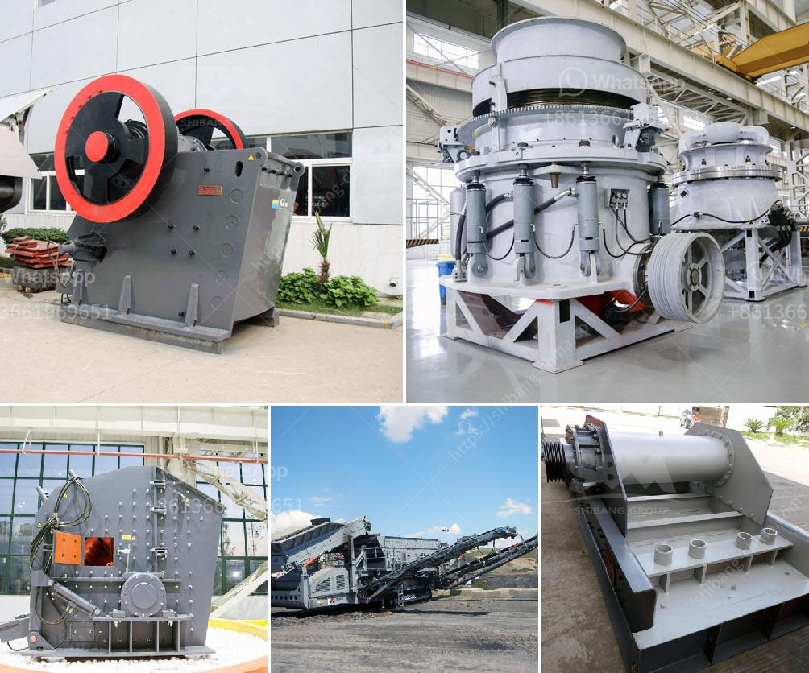

<h3>copper crusher manufacturer in turkey</h3>
Copper is one of the oldest and most widely used metals in the world. It has various electrical, thermal, and mechanical properties that make it an essential element in numerous industries. One of the primary uses of copper is in the manufacturing of electrical wires and cables, where its excellent conductivity allows for efficient transmission of electricity.

Turkey is a country known for its rich copper deposits. In fact, it is one of the top copper-producing nations globally. With such abundant resources, it comes as no surprise that Turkey is also home to several manufacturers specializing in copper crushers. These machines are specifically designed to crush copper-bearing rocks and separate the metal from the surrounding rock and ore.

A copper crusher manufacturer in Turkey, Shibang Machinery Co. Ltd., is a specialized company in the research, development, and production of industrial crushing, powder grinding, mineral processing equipment, and other related devices. Our products have been sold to 120 countries and areas of Southeast Asia, East Europe, South America, the Middle East, and Africa, and will undoubtedly continue to expand their presence in the international market.

The copper crusher machines manufactured by Shibang Machinery Co. Ltd. have advanced features, such as large crushing ratio, high efficiency, low energy consumption, and uniform particle size. They are suitable for various crushing operations, including primary crushing, secondary crushing, and tertiary crushing of copper ores. The machines are also equipped with hydraulic systems that allow easy adjustment of the discharge port and quick replacement of wearing parts, ensuring minimal downtime and increased productivity.

Moreover, Shibang Machinery Co. Ltd. provides comprehensive pre-sales, sales, and after-sales services. Our dedicated team of engineers and technicians are available to assist customers with their specific requirements and provide technical support whenever needed. We also offer professional installation guidance and training to ensure the smooth operation of our copper crushers.

In conclusion, Turkey is home to several reputable copper crusher manufacturers, and Shibang Machinery Co. Ltd. stands out among them. With its advanced technology, high-quality products, and excellent customer service, it has become a trusted name in the industry. Whether you are in Turkey or any other part of the world, Shibang Machinery Co. Ltd. is your reliable partner for all your copper crushing needs.
<h3>Contact us</h3><ul><li><strong>Whatsapp:&nbsp;<a href="https://wa.me/8613661969651">+8613661969651</a></strong></li><li><a href="https://swt.shibang-china.com/?git&amp;zhl&amp;copper crusher manufacturer in turkey"><strong>Online Service(chat now)</strong></a></li></ul><h3>Related</h3><ul><li><a href='stone paper production process.md'>stone paper production process</a></li><li><a href='granite quarry machinery from turkey.md'>granite quarry machinery from turkey</a></li><li><a href='rodillos para trituradoras en bogota.md'>rodillos para trituradoras en bogota</a></li><li><a href='raymond mill company.md'>raymond mill company</a></li><li><a href='crusher manufacturers prices.md'>crusher manufacturers prices</a></li></ul>