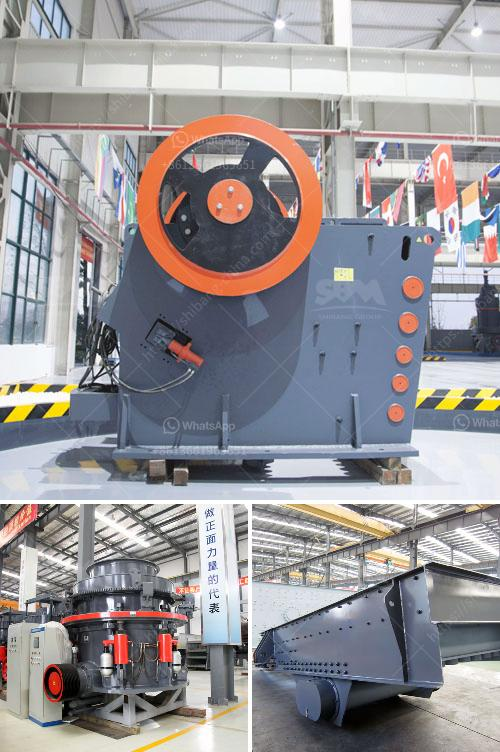

<h3>copper crusher suppliers in zambia</h3>
Copper is one of the key materials used in various industries, including infrastructure development, electrical equipment manufacturing, transportation, and many others. Zambia is the world's fourth largest producer of copper and is a major supplier for the global copper industry. As such, it attracts interest from both local and international suppliers.

Zambia's copper production has been on a steady rise since the 1960s, and has now reached around 900,000 metric tons per year. This has made the country a significant player in the global copper market, with the mineral accounting for around 70% of Zambia's total export revenue.

One of the critical components in the copper production process is the crushing of the copper ore. Copper crushers are used to break up the copper ore into smaller particles for further processing. These machines are ideal for processing copper ore with high hardness, as well as for creating a high-quality end product.

In Zambia, there are several copper crusher suppliers, who provide machines and equipment for the mining industry. These suppliers offer both stationary and mobile crushers, allowing companies to choose the most suitable option for their needs.

Some of the suppliers for copper crushers in Zambia include Metso Minerals, FLSmidth, and Sandvik. Each supplier provides unique products and services, ensuring that customers have access to a wide range of options when it comes to selecting the right crusher for their operations.

Metso Minerals is a global leader in the copper mining industry, and their crushers are designed to maximize productivity and reduce operating costs. Their range of crushers includes both jaw crushers and cone crushers, which are highly efficient and reliable machines.

FLSmidth is another major supplier of copper crushers in Zambia. They offer a comprehensive range of products, including both primary and secondary crushers, as well as screens, feeders, and conveyors. FLSmidth's crushers are known for their durability and exceptional performance, even in the harshest conditions.

Sandvik is also a reputable supplier of copper crushers in Zambia. Their crushers are known for their cutting-edge technology and innovative features. Sandvik's range includes both jaw crushers and impact crushers, ensuring that customers can find the perfect solution for their specific needs.

These copper crusher suppliers in Zambia not only offer high-quality products but also provide excellent after-sales support. They understand the importance of customer satisfaction and are committed to helping their clients achieve success. Whether it is providing technical assistance, spare parts or maintenance services, these suppliers go above and beyond to ensure their customers' needs are met.

In conclusion, copper crusher suppliers in Zambia play a crucial role in the mining industry. They provide machines and equipment that are essential for the crushing and processing of copper ore, ensuring that high-quality products are created. With several reliable suppliers in the market, companies have access to a wide range of crusher options, allowing them to select the best one for their specific requirements. By partnering with these suppliers, mining companies in Zambia can maximize their productivity, reduce operating costs, and ultimately contribute to the growth of the global copper industry.
<h3>Contact us</h3><ul><li><strong>Whatsapp:&nbsp;<a href="https://wa.me/8613661969651">+8613661969651</a></strong></li><li><a href="https://swt.shibang-china.com/?git&amp;zhl&amp;copper crusher suppliers in zambia"><strong>Online Service(chat now)</strong></a></li></ul><h3>Related</h3><ul><li><a href='100 tph hammer mill kenya.md'>100 tph hammer mill kenya</a></li><li><a href='second hand quarry cruher equipment price south africa.md'>second hand quarry cruher equipment price south africa</a></li><li><a href='iron ore beneficiation process price.md'>iron ore beneficiation process price</a></li><li><a href='rock quarry plant.md'>rock quarry plant</a></li><li><a href='hammer mill gauteng.md'>hammer mill gauteng</a></li></ul>