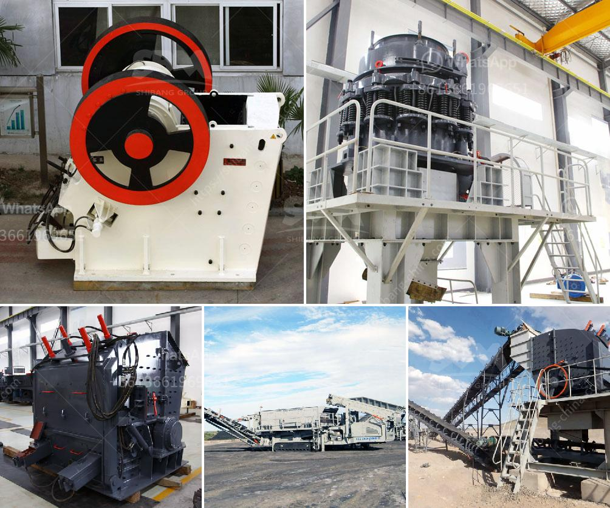

<h3>copper crushing machines manufacturers in china</h3>
China is known for its vast industrial capacity and increase in manufacturing capabilities. It comes as no surprise that the country hosts a large number of copper crushing machine manufacturers. With the rise in demand for copper-related products, these manufacturers have been catering to the needs of both domestic and international markets.

Copper is a highly versatile metal used for various purposes, such as in electrical wiring, plumbing, and electronics. This widespread usage has led to a significant increase in demand for copper products worldwide. The need for efficient copper crushing machines has become crucial to meet this demand.

Chinese manufacturers have stepped up to the challenge by producing a wide array of copper crushing machines. These machines are designed to process copper ores into desired particle sizes for further processing. Copper crushing machines can crush the raw material into small particles, allowing for easier handling and transportation.

One of the primary copper crushing machine manufacturers in China is Henan Hongxing Mining Machinery Co., Ltd. This company has been instrumental in producing a wide range of copper crushing machines for various industries. Their machines are known for their high-quality construction, durability, and efficient operation.

Another prominent copper crushing machine manufacturer is Shibang Industry & Technology Group Co., Ltd. This company offers a comprehensive range of machines, including jaw crushers, cone crushers, impact crushers, and mobile crushers, to cater to the diverse needs of their customers. Shibang's machines are known for their advanced technology and reliable performance.

Yantai Xinhai Mining Machinery Co., Ltd. is also a key player in the Chinese copper crushing machine market. They provide a range of crushing machines specifically designed for copper ore processing. These machines are known for their robust construction and efficient operation, ensuring maximum productivity for their users.

Apart from these major players, there are several other manufacturers in China specializing in copper crushing machines. This competition has prompted manufacturers to continuously improve their machines' quality and performance to stay ahead in the market.

Chinese manufacturers are also known for their competitive pricing, making their copper crushing machines more attractive to buyers worldwide. The cost-effectiveness of these machines is a significant factor driving their popularity in both emerging and developed markets.

Furthermore, Chinese manufacturers are increasingly focusing on environmental sustainability. They are incorporating energy-saving technologies into their machines to reduce energy consumption and minimize the impact on the environment. This eco-friendly approach resonates well with global customers seeking sustainable solutions.

In conclusion, China hosts a large number of copper crushing machine manufacturers who cater to the global demand for copper-related products. These manufacturers offer a wide range of machines with high-quality construction, efficient operation, and competitive pricing. Additionally, they are increasingly adopting eco-friendly practices to meet the demand for sustainable solutions. With continued technological advancements, the Chinese copper crushing machine market is likely to thrive and serve the needs of a growing industry.
<h3>Contact us</h3><ul><li><strong>Whatsapp:&nbsp;<a href="https://wa.me/8613661969651">+8613661969651</a></strong></li><li><a href="https://swt.shibang-china.com/?git&amp;zhl&amp;copper crushing machines manufacturers in china"><strong>Online Service(chat now)</strong></a></li></ul><h3>Related</h3><ul><li><a href='aggregate roller crushing mill malaysia.md'>aggregate roller crushing mill malaysia</a></li><li><a href='alluvial gold mining methods in zimbabwe.md'>alluvial gold mining methods in zimbabwe</a></li><li><a href='diamond mining equipment companies in usa.md'>diamond mining equipment companies in usa</a></li><li><a href='roller mill for muradabad.md'>roller mill for muradabad</a></li><li><a href='ball grinder machine.md'>ball grinder machine</a></li></ul>