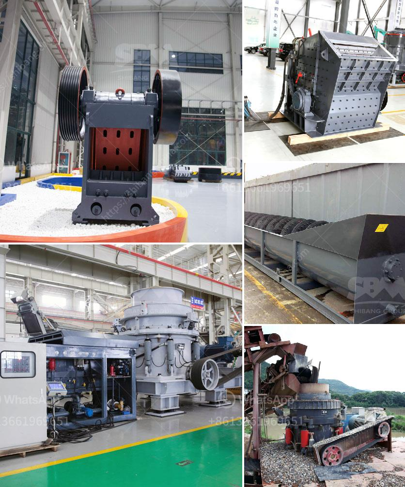

<h3>copper ore concentrator price</h3>
Copper is one of the most widely used metals in various industries due to its excellent properties such as high electrical and thermal conductivity, resistance to corrosion, and flexibility in shaping. The demand for copper has been skyrocketing, leading to an increased focus on mining and ore processing. One crucial equipment in this process is the copper ore concentrator, which is responsible for extracting and purifying copper from its ores. Understanding the factors influencing the cost of a copper ore concentrator is essential for both miners and investors.

The first factor affecting the price of a copper ore concentrator is the quality and content of the copper ore being processed. Copper ores can contain various impurities and mineral compositions that require different methods and processes to extract copper efficiently. Higher-grade ores with higher copper content tend to require less processing, resulting in lower production costs. Therefore, the price of a copper ore concentrator can be higher for ores with lower quality or those requiring additional purification steps.

The size and capacity of the concentrator also play a crucial role in determining its price. Concentrators come in various sizes, ranging from small-scale units to large industrial plants. Standalone, smaller concentrators that process relatively low volumes of ore tend to have lower prices. On the other hand, larger concentrators with higher capacities and advanced technologies for faster extraction and higher throughput are typically more expensive to purchase and operate.

Energy costs are another significant factor impacting the price of a copper ore concentrator. Extracting copper from its ores requires a substantial amount of energy, especially during the crushing, grinding, and flotation processes. The rising energy prices can significantly increase the overall operating costs of a concentrator, impacting its price. Implementing energy-efficient technologies and utilizing renewable energy sources can help reduce these costs and make the concentrator more economical.

The availability and costs of labor and skilled workforce are essential considerations when determining the price of a copper ore concentrator. Skilled personnel are needed to operate and maintain the equipment, ensuring its optimal performance and maximizing copper recovery. Higher labor costs, scarcity of skilled labor, or the need to hire specialized workers can drive up the price of a concentrator.

Maintenance and operational costs also factor into the overall price of a copper ore concentrator. Regular maintenance is crucial to keep the equipment running efficiently and prevent downtime. The cost of spare parts, repairs, and preventive maintenance can significantly impact the final price. Investing in high-quality equipment with reliable performance and a longer operational life span can offset some of the maintenance and operational costs, making a concentrator more cost-effective in the long run.

In conclusion, the price of a copper ore concentrator is influenced by various factors, including the quality and composition of the copper ore, size and capacity of the concentrator, energy costs, availability of skilled labor, and maintenance expenses. Miners and investors should consider these factors carefully when evaluating the economics of a copper ore concentrator. A thorough assessment of all these aspects will help determine the feasibility and profitability of a concentrator in the competitive copper market.
<h3>Contact us</h3><ul><li><strong>Whatsapp:&nbsp;<a href="https://wa.me/8613661969651">+8613661969651</a></strong></li><li><a href="https://swt.shibang-china.com/?git&amp;zhl&amp;copper ore concentrator price"><strong>Online Service(chat now)</strong></a></li></ul><h3>Related</h3><ul><li><a href='stone crushing plant supplier south africa.md'>stone crushing plant supplier south africa</a></li><li><a href='bentonite crushing machine price list.md'>bentonite crushing machine price list</a></li><li><a href='quartz stone 30 80 plant process.md'>quartz stone 30 80 plant process</a></li><li><a href='mobile screening and crushing equipment.md'>mobile screening and crushing equipment</a></li><li><a href='sand washing machine for sale.md'>sand washing machine for sale</a></li></ul>