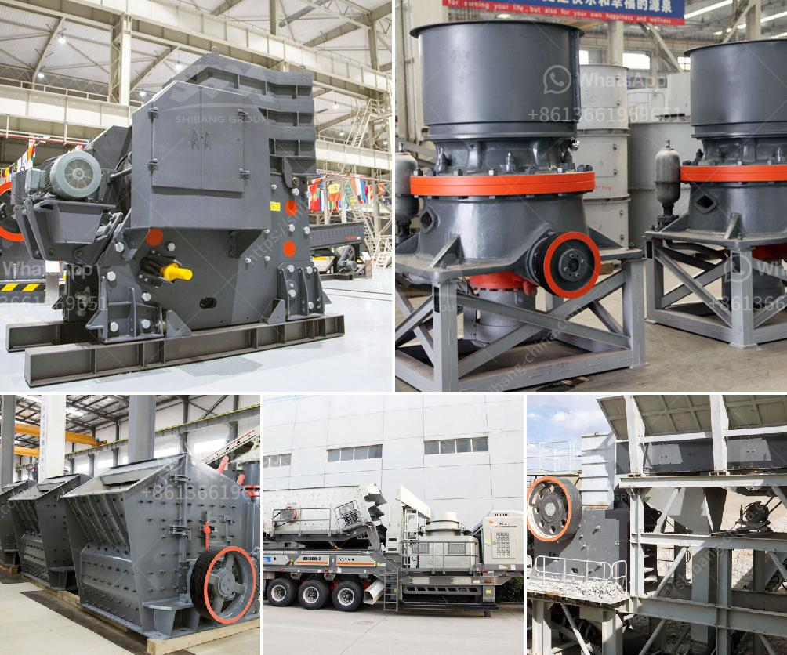

<h3>copper ore machine in china</h3>
China, known for its rapid industrialization and urbanization, has witnessed significant growth in its manufacturing sector over the past few decades. As the world's largest exporter, China has become a hub for various industries, including the mining sector. Within this sector, the extraction and processing of copper ore have gained substantial attention due to the country's abundant reserves and increasing demand.

Copper ore is a vital raw material in multiple industries, predominantly utilized in electrical wiring, telecommunications, electronics, and construction materials. With the continuous development of China's infrastructure and the rising demand for electricity, the demand for copper has reached unprecedented levels. Consequently, the need for efficient copper ore machines has become crucial in the industry.

One of the key players in China's copper ore machine industry is Fote Machinery Co., Ltd. With over 40 years of experience, the company has established itself as a reputable manufacturer and supplier. Fote Machinery is known for its innovative technologies, advanced manufacturing facilities, and exceptional customer service.

Fote Machinery offers a wide range of copper ore machines, including crushers, mills, flotation machines, and magnetic separators. These machines are essential in every stage of copper ore processing, enabling the extraction of pure copper from the ore through various methods.

The crushers provided by Fote Machinery are designed to break down the large chunks of copper ore into smaller, manageable sizes. These machines ensure efficient crushing and minimize energy consumption. Additionally, Fote Machinery's crushers have a high crushing ratio, which enhances the extraction process and reduces the amount of waste generated during the process.

Mills are another vital component in copper ore processing. Fote Machinery's mills are designed to grind the copper ore into fine particles, allowing for better separation of copper from other impurities. These mills are equipped with advanced technology, such as an optimized grinding system and automation control, ensuring high productivity and energy efficiency.

After the grinding process, flotation machines are used to separate copper minerals from the gangue. Fote Machinery's flotation machines employ the latest technology, including self-suction and self-priming functions, to achieve optimal separation efficiency. These machines are also equipped with automatic level control systems to ensure stable operation and minimize human error.

To further enhance the purity of the extracted copper, Fote Machinery's magnetic separators are utilized. These separators effectively remove impurities and magnetic materials, resulting in a higher grade of copper concentrate. By employing strong magnetic fields, Fote Machinery's magnetic separators ensure efficient separation and increase the overall economic value of the extracted copper.

In conclusion, the copper ore machine industry in China is a promising sector that plays a vital role in meeting the growing demand for copper. With Fote Machinery's advanced technologies and comprehensive range of machines, the extraction and processing of copper ore have been significantly optimized. As China continues its industrial development, the copper ore machine industry will continue to thrive, providing essential support to various sectors of the economy.
<h3>Contact us</h3><ul><li><strong>Whatsapp:&nbsp;<a href="https://wa.me/8613661969651">+8613661969651</a></strong></li><li><a href="https://swt.shibang-china.com/?git&amp;zhl&amp;copper ore machine in china"><strong>Online Service(chat now)</strong></a></li></ul><h3>Related</h3><ul><li><a href='grinding mill machine for sale.md'>grinding mill machine for sale</a></li><li><a href='ballast stone crusher in india.md'>ballast stone crusher in india</a></li><li><a href='marble powder crusher plant.md'>marble powder crusher plant</a></li><li><a href='quartz ball for ball mill.md'>quartz ball for ball mill</a></li><li><a href='clay processing technology.md'>clay processing technology</a></li></ul>