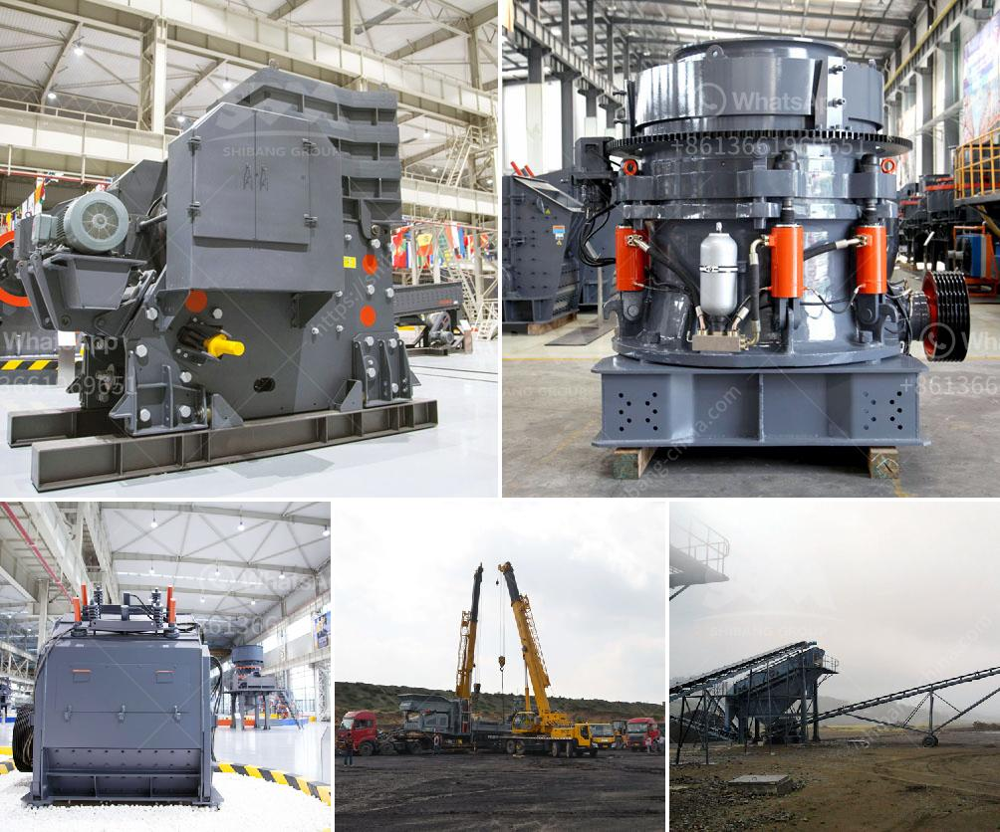

<h3>copper ore mining for sale in philippines</h3>
Copper is found in many minerals which occur in deposits, large enough to be easily mined. These include chalcopyrite and bornite. Copper is also found in other minerals such as chalcocite, cuprite, and malachite. It is extracted from an open-pit or underground mine.

The Philippines is known for its rich copper deposits, with the country being the 5th largest copper producer worldwide. Copper mining has played a significant role in the country's economic prosperity, contributing to employment opportunities and economic growth.

One of the potential selling points for copper ore mining in the Philippines is its high copper content. The average copper ore grade in the country ranges from 0.5% to 2.5%, which is relatively high compared to other copper-producing countries. This high copper grade makes the mining process more efficient, as a higher percentage of copper can be extracted from each ton of ore mined, resulting in higher profits for mining companies.

Furthermore, the Philippines has a favorable geological setting for copper ore deposits. The country is part of the Pacific Ring of Fire, an area known for its high concentration of mineral resources. This geographical advantage makes the Philippines an attractive destination for mining companies looking to tap into its copper reserves.

Aside from its high copper content and favorable geological setting, the Philippines also offers a conducive environment for mining operations. The government has implemented various policies and regulations to attract foreign investments in the mining sector, including the Mining Act of 1995. This legislation provides a clear legal framework for mining companies and offers financial incentives to encourage investment in the industry.

The mining industry in the Philippines has faced challenges in recent years, including environmental concerns and regulatory issues. However, the government has taken measures to address these concerns, improving the overall business environment for mining companies.

For potential buyers, investing in copper ore mining in the Philippines can be a profitable venture. The increasing demand for copper, driven by industrialization, urbanization, and the transition to renewable energy sources, ensures a steady market for copper products. As the world becomes increasingly reliant on copper, the demand for this versatile metal will continue to rise.

Moreover, the Philippine government's commitment to mining and the ease of doing business in the country provide a supportive environment for buyers interested in copper ore mining. With the right technology, infrastructure, and expertise, mining companies can maximize the extraction and processing of copper ore, creating a sustainable and profitable business.

In conclusion, copper ore mining in the Philippines offers a promising opportunity for investors. The country's high copper content, favorable geological setting, and supportive government policies contribute to the industry's potential success. By leveraging these advantages, mining companies can tap into the growing demand for copper and contribute to the economic development of the Philippines.
<h3>Contact us</h3><ul><li><strong>Whatsapp:&nbsp;<a href="https://wa.me/8613661969651">+8613661969651</a></strong></li><li><a href="https://swt.shibang-china.com/?git&amp;zhl&amp;copper ore mining for sale in philippines"><strong>Online Service(chat now)</strong></a></li></ul><h3>Related</h3><ul><li><a href='10 tpd grindig mill manufacturers philippines.md'>10 tpd grindig mill manufacturers philippines</a></li><li><a href='cement making machines for factory.md'>cement making machines for factory</a></li><li><a href='bauxite crusher manufacturer.md'>bauxite crusher manufacturer</a></li><li><a href='limestone ore processing plant.md'>limestone ore processing plant</a></li><li><a href='mineral processing calculations pdf.md'>mineral processing calculations pdf</a></li></ul>