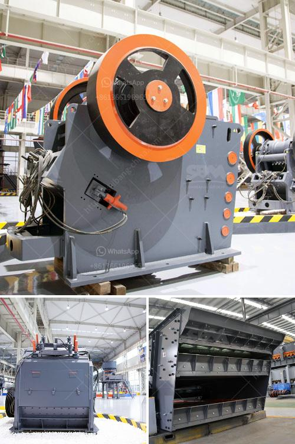

<h3>copper ore processing machines in usa</h3>
Copper is one of the most versatile and widely used metals in the world. It is a vital resource in various industries, including construction, electronics, and telecommunications. To extract copper from its ore, the processing process becomes crucial. In the United States, several machines are utilized to achieve efficient copper ore processing. This article will explore some of these machines.

The first step in copper ore processing is crushing and grinding. Jaw crushers and cone crushers are commonly used for this purpose. They break down the larger rocks into smaller pieces suitable for further processing. Afterward, ball mills are employed to grind the crushed ore into a fine powder. This grinding process ensures proper liberation of copper-bearing minerals from the surrounding rock.

Once the ore is finely ground, it undergoes flotation, a key stage in copper ore processing. Flotation machines are utilized to separate valuable minerals from other non-valuable substances present in the ore. In this process, various chemicals, known as reagents, are added to facilitate the separation process. These chemicals selectively bind to the copper minerals, making them hydrophobic or water repellent. As a result, the minerals rise to the top of the flotation machine, forming a froth layer, while the other non-valuable substances sink. This froth, rich in copper minerals, is then collected and further processed.

To further enhance the quality of the copper concentrate obtained from the flotation process, the concentrate is sent to smelters for further refining. Smelting involves subjecting the concentrate to high temperatures in a furnace to separate copper from impurities such as sulfur, iron, and precious metals. Reverberatory furnaces and flash smelting furnaces are commonly used in the United States for this purpose. The molten copper obtained from the smelting process is then refined to remove any remaining impurities.

In addition to the above machines, other equipment is also employed to ensure smooth copper ore processing. These include conveyors, which transport the crushed ore and concentrate from one processing stage to another. Screens and cyclones are used to classify the ore and separate it into different sizes for further processing. Magnetic separators are utilized to remove any magnetic impurities from the ore. Finally, the processed copper concentrate is often thickened and filtered before being transported for further refining or export.

In conclusion, copper ore processing in the United States involves a range of machines to ensure efficient extraction and refining of copper. Jaw crushers, cone crushers, ball mills, flotation machines, and smelting furnaces are some of the key machines used in this process. Each machine plays a crucial role in separating valuable copper minerals from the surrounding rock and impurities. With the help of these machines, the USA continues to fulfill its demand for copper and contribute to various sectors that rely on this versatile metal.
<h3>Contact us</h3><ul><li><strong>Whatsapp:&nbsp;<a href="https://wa.me/8613661969651">+8613661969651</a></strong></li><li><a href="https://swt.shibang-china.com/?git&amp;zhl&amp;copper ore processing machines in usa"><strong>Online Service(chat now)</strong></a></li></ul><h3>Related</h3><ul><li><a href='ball mill italia.md'>ball mill italia</a></li><li><a href='twist of the ball mill.md'>twist of the ball mill</a></li><li><a href='talc powder crushers.md'>talc powder crushers</a></li><li><a href='nigeria granite crushers.md'>nigeria granite crushers</a></li><li><a href='gypsum crusher machine for sale.md'>gypsum crusher machine for sale</a></li></ul>