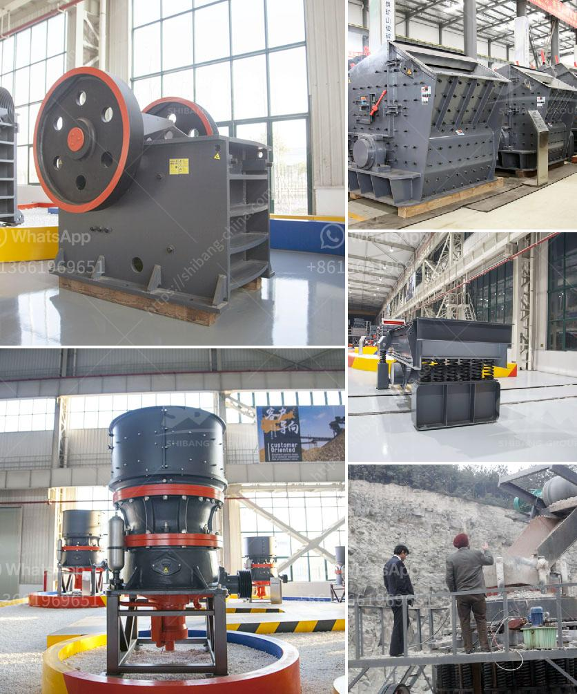

<h3>corncob crusher machine</h3>
Corn is a versatile crop that is widely used in various industries, from food production to animal feed. One of the essential processes in corn production is the crushing of corncobs to extract the valuable kernels and other by-products. The corncob crusher machine, also known as corncob shredder, is an essential equipment for corncob recycling.

It adopts the advanced technology and unique structural design, which ensures efficient and safe operation. Then, how does the corncob crusher machine work? In the crushing chamber, the motor drives the rotor to rotate at a high speed through the belt, and on the rotor, there are series of hammers. When the materials enter the crushing chamber from the feeding hopper, they are impacted by the high-speed rotating hammers. The crushed corncob particles are then discharged through the sieve hole, and the coarse and fine particles will be separated.

The corncob crusher machine is designed to work efficiently and reliably. It consists of a feed hopper, motor, spindle assembly, crushing blade, sieve plate, etc. Integrated structure and modular design make it easy to install, maintain and operate. The machine adopts multiple protection devices, such as the motor fault protector and the electrical interlocking system, to ensure the operation stability and personal safety.

In addition to the main structure, there are also some optional accessories for the corncob crusher machine, such as the cyclone dust collector and the suction fan, which can effectively collect the crushed fine particles. This not only guarantees a clean operating environment but also reduces particle flying during the crushing process, avoiding potential harm to the operator.

The corncob crusher machine solves the shortcomings of traditional hammer mills and roller mills. The newly developed corncob crusher machine is a kind of hammer mill crusher. The main material of the corncob is corn cob, which has high hardness, high toughness, high moisture content, high molding difficulty, and low output. The corncob crusher machine produced by our company is a device specially used for crushing corn cobs in bulk. It greatly solves the shortcomings of the existing straw crushing equipment.

In essence, the corncob crusher machine elaborately explores a new field of straw crusher, which adds to the value of the corn stalk, increases profits, and effectively promotes the comprehensive utilization of straw resources. Moreover, the corncob crusher machine adopts closed structure design, effectively reducing dust pollution, minimizing noise, and creating a green and clean production environment.

In conclusion, the corncob crusher machine is a new type of straw crushing equipment in the market, which diversifies the application range of straw resources and also guarantees the quality of straw crushing. It provides strong support for the comprehensive utilization of straw resources, and it helps to improve economic efficiency and environmental benefits. With the continuous development of technology, we believe that the corncob crusher machine will have more extensive applications and play a more important role in the future.
<h3>Contact us</h3><ul><li><strong>Whatsapp:&nbsp;<a href="https://wa.me/8613661969651">+8613661969651</a></strong></li><li><a href="https://swt.shibang-china.com/?git&amp;zhl&amp;corncob crusher machine"><strong>Online Service(chat now)</strong></a></li></ul><h3>Related</h3><ul><li><a href='how does a stone crusher plant operate.md'>how does a stone crusher plant operate</a></li><li><a href='raymond mill for.md'>raymond mill for</a></li><li><a href='used crushers in germany for sale.md'>used crushers in germany for sale</a></li><li><a href='complete crushing for sale with price.md'>complete crushing for sale with price</a></li><li><a href='ball milling equipment and milling media.md'>ball milling equipment and milling media</a></li></ul>