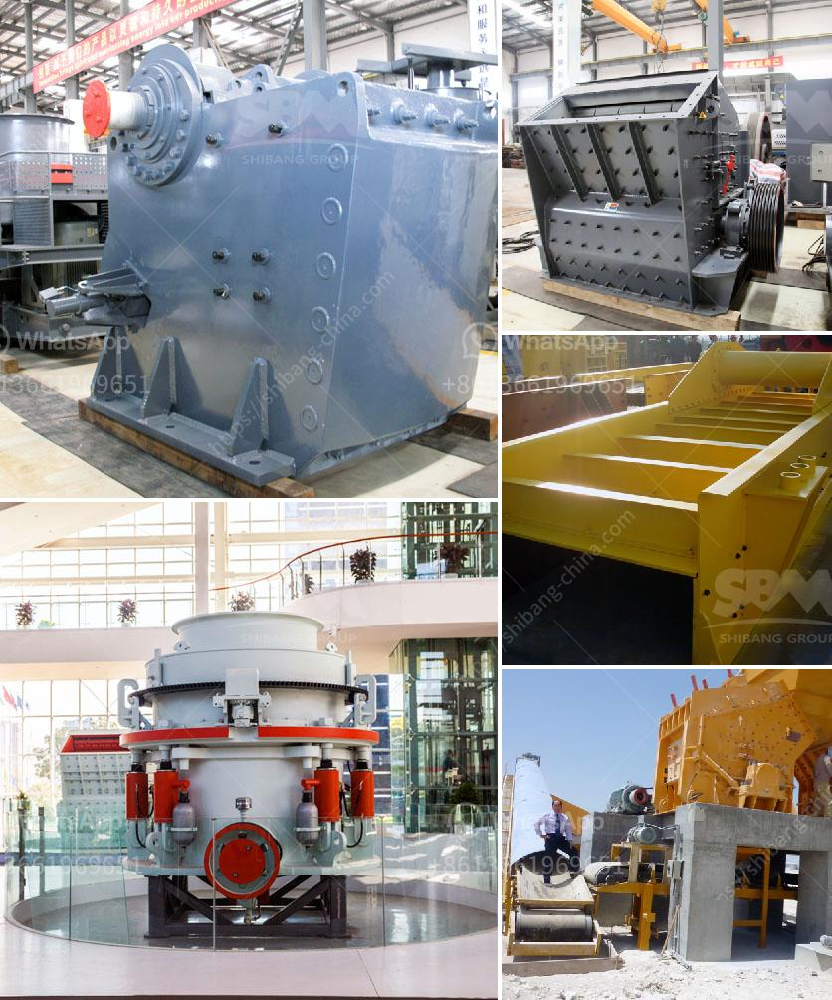

<h3>cost estimation for ball mills</h3>
Ball mills are extensively used in the production of cement, silicate products,  new building materials, refractory materials, fertilizers, black and non-ferrous metal dressings, and glass ceramics. With their cost-effective operation and ease of maintenance, they are a top choice in the grinding and milling processes.

When it comes to estimating the cost of a ball mill, there are several factors to consider. First and foremost is the cost of the equipment itself. It is important to note that the prices of ball mills can vary greatly depending on the size, features, and design chosen. Larger mills will naturally cost more than smaller ones, and additional features such as automatic control systems or higher-quality materials can significantly increase the price.

Another factor to consider is the installation cost. The size and weight of ball mills usually require special installation procedures and equipment, which can add to the overall expense. Additionally, the location and site conditions may also affect the installation cost. For example, if the mill needs to be installed in a remote area without proper infrastructure, transportation costs and logistical challenges will be higher.

The cost of operation and maintenance is another important aspect to be considered. Ball mills require regular maintenance to ensure optimal performance and longevity. This includes routine inspections, lubrication, and the replacement of worn-out parts. The cost of spare parts and maintenance personnel should be factored into the overall cost estimation.

In addition to the equipment and operational costs, it is essential to consider the energy consumption of the ball mills. These machines can consume a significant amount of electricity during operation, and the cost of power should be accounted for. Energy-efficient models or optimizing the grinding process can help reduce power consumption and lower operating costs.

In conclusion, estimating the cost of ball mills involves considering various factors such as the cost of the equipment, installation, operation, and maintenance. Investing in high-quality equipment and efficient grinding processes can lead to long-term savings. Therefore, it is crucial to carefully evaluate these factors before making a decision on the cost estimation of ball mills.
<h3>Contact us</h3><ul><li><strong>Whatsapp:&nbsp;<a href="https://wa.me/8613661969651">+8613661969651</a></strong></li><li><a href="https://swt.shibang-china.com/?git&amp;zhl&amp;cost estimation for ball mills"><strong>Online Service(chat now)</strong></a></li></ul><h3>Related</h3><ul><li><a href='stone crusher plant capacity 500 600 tph.md'>stone crusher plant capacity 500 600 tph</a></li><li><a href='roller mill malaysia.md'>roller mill malaysia</a></li><li><a href='china mobile stone crusher machine.md'>china mobile stone crusher machine</a></li><li><a href='single cylinder hydraulic cone crusher.md'>single cylinder hydraulic cone crusher</a></li><li><a href='300tpd mini cement plant cost in india.md'>300tpd mini cement plant cost in india</a></li></ul>