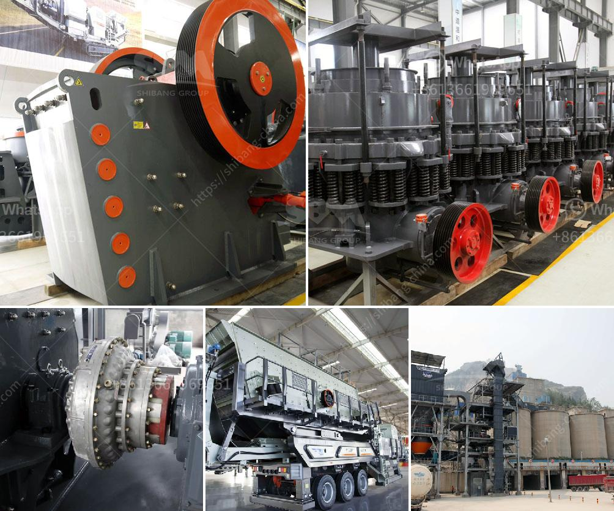

<h3>cost gravel crusher</h3>
A gravel crusher is a vital tool for the reclamation, restoration, and maintenance of gravel roads. It is not only used to crush gravel to produce smaller rocks but also to create gravel dust and sand. The cost of gravel crushers varies depending on the specific model, capacity, and manufacturer. In this article, we will explore the different factors that affect the cost of a gravel crusher.

Firstly, the capacity of the gravel crusher plays a significant role in determining the cost. Crushers with higher capacities are generally more expensive than their lower-capacity counterparts. A crusher with a higher capacity is capable of processing more material in less time, resulting in improved productivity and efficiency.

Secondly, the type and quality of materials used in the construction of the crusher affect its cost. Crushers made from premium-grade materials are more expensive but offer better durability and longevity. Cheaper crushers may be made from lower-quality materials, which can negatively impact their performance and lifespan. It is essential to strike a balance between cost and quality to ensure a value-for-money investment.

Additionally, the manufacturer also influences the cost of a gravel crusher. Well-established and reputable manufacturers often charge a higher price for their products due to their brand reputation and the quality control they maintain. However, choosing a reliable manufacturer ensures that you will receive a high-quality and dependable crusher that is worth the investment.

Furthermore, additional features and accessories included with the crusher can also impact its cost. Some crushers come with advanced features like automatic lubrication systems, remote control operation, or even wireless communication capabilities. While these features enhance convenience and usability, they also contribute to the overall cost of the crusher.

In conclusion, the cost of a gravel crusher depends on several factors such as capacity, quality of materials, manufacturer, and additional features. It is crucial to evaluate these factors carefully before making a purchasing decision to ensure you get the most cost-effective crusher that meets your specific requirements and offers long-term value.
<h3>Contact us</h3><ul><li><strong>Whatsapp:&nbsp;<a href="https://wa.me/8613661969651">+8613661969651</a></strong></li><li><a href="https://swt.shibang-china.com/?git&amp;zhl&amp;cost gravel crusher"><strong>Online Service(chat now)</strong></a></li></ul><h3>Related</h3><ul><li><a href='crusher machine plant estimation cost.md'>crusher machine plant estimation cost</a></li><li><a href='cost of limestone crusher plant.md'>cost of limestone crusher plant</a></li><li><a href='crushing plant turkey.md'>crushing plant turkey</a></li><li><a href='maize grinding mill in philippines south africa.md'>maize grinding mill in philippines south africa</a></li><li><a href='jaw crusher in uganda.md'>jaw crusher in uganda</a></li></ul>