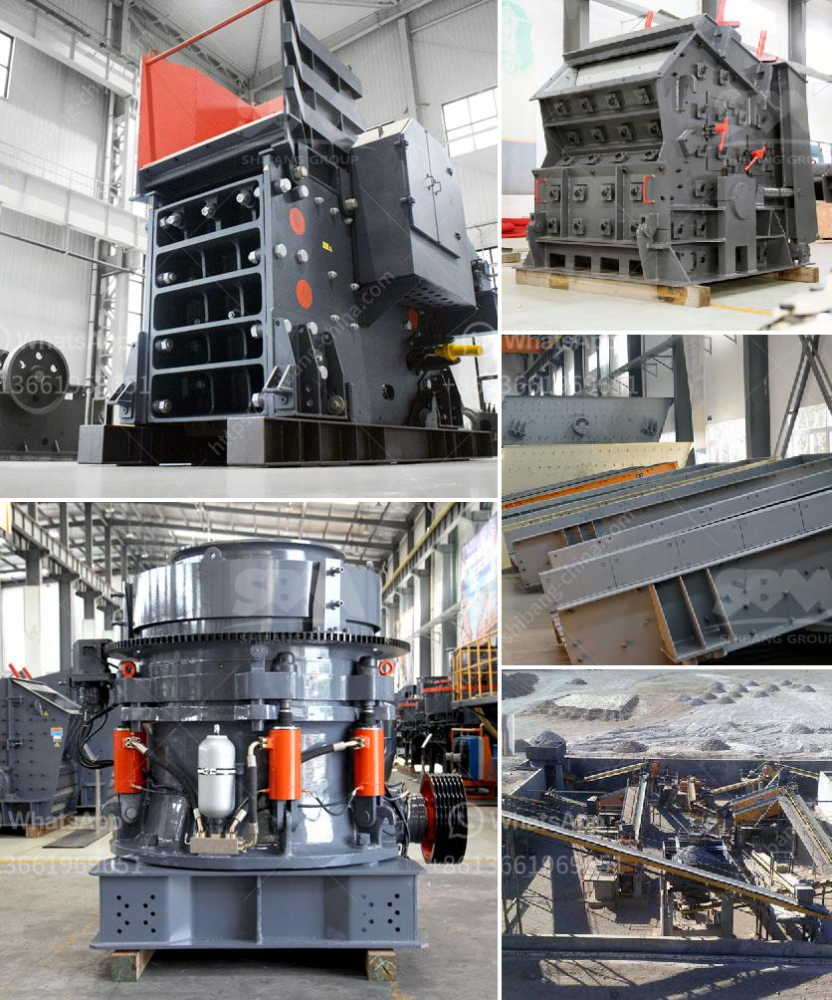

<h3>cost of 500 tpd cement plant india</h3>
India is the second-largest producer of cement in the world, and the cement industry plays a crucial role in the country's economic development. As the demand for cement continues to rise, many companies are looking to set up new cement plants in India to meet this growing demand. One such type of cement plant is a 500 TPD cement plant.

A 500 TPD cement plant is a small-scale production line with a capacity of 500 tons per day. The cement plant is designed to be environmentally friendly and energy-efficient. It consists of crushing, pre-homogenization, raw material grinding and homogenization, clinker calcination, cement grinding, and packing processes.

The cost of setting up a 500 TPD cement plant in India depends on various factors such as the location and size of the plant, the type of technology used, site infrastructure, and other miscellaneous expenses. On average, it can cost anywhere between $50 million to $100 million or more to set up a 500 TPD cement plant in India.

1. Land and site development: This includes acquiring land for the plant and developing it for construction. It can cost around 10-15% of the total project cost.

2. Plant and machinery: The cost of setting up the plant and installing machinery such as crushers, mills, kiln, and packing units can be around 30-40% of the total project cost.

3. Utilities and infrastructure: This includes setting up utilities such as power supply, water sources, and other infrastructure requirements. It can constitute around 10-15% of the total cost.

4. Raw material and fuel: The cost of procuring raw materials such as limestone, clay, gypsum, and fuel like coal or petcoke is a significant expense. It can account for 20-25% of the total cost.

5. Labor and manpower: This includes hiring skilled and unskilled labor, engineers, technicians, and managerial staff. It can be around 5-10% of the total cost.

6. Miscellaneous expenses: Other expenses such as legal permits, transport, marketing, and contingencies may constitute approximately 10% of the total cost.

It's important to note that these cost estimates are approximate and can vary depending on several factors. Additionally, regulatory and environmental compliance costs may also impact the overall project cost.

In conclusion, setting up a 500 TPD cement plant in India can require a significant investment. However, with the growing demand for cement in the country, this investment can provide substantial returns in the long run. Moreover, the development of a cement plant contributes to the economic growth and employment generation in the region.
<h3>Contact us</h3><ul><li><strong>Whatsapp:&nbsp;<a href="https://wa.me/8613661969651">+8613661969651</a></strong></li><li><a href="https://swt.shibang-china.com/?git&amp;zhl&amp;cost of 500 tpd cement plant india"><strong>Online Service(chat now)</strong></a></li></ul><h3>Related</h3><ul><li><a href='organic fertilizer production line in india.md'>organic fertilizer production line in india</a></li><li><a href='business plan for a quarry crusher.md'>business plan for a quarry crusher</a></li><li><a href='what is the feed of jaw crusher.md'>what is the feed of jaw crusher</a></li><li><a href='iron ore beneficiation process price.md'>iron ore beneficiation process price</a></li><li><a href='buy nigeria stone crusher.md'>buy nigeria stone crusher</a></li></ul>