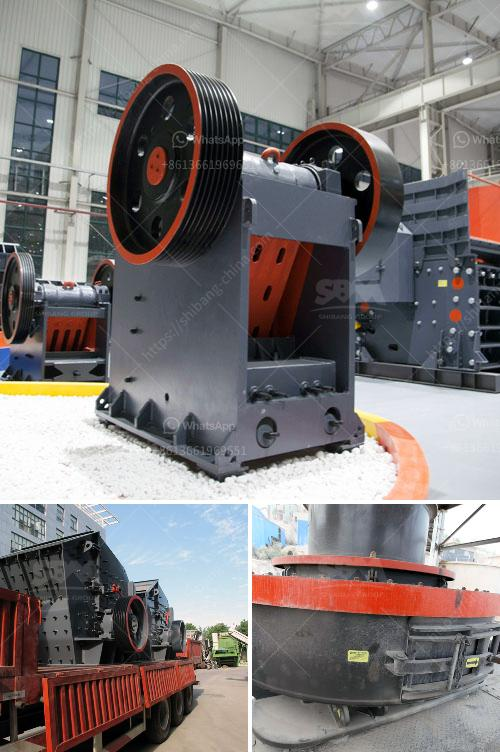

<h3>cost of a medium size stone crusher</h3>
The development of modern industry is inseparable from the application of large-sized stone crushers. Nowadays, the stone crusher market is fiercely competitive. As for the cost of a medium-sized crusher, it is naturally more expensive and more advanced than the simple jaw crusher or cone crusher. Machinery is a high-tech enterprise integrating R&D, production, sales and service. Here, we will analyze the cost of a medium-sized stone crusher. We will give detailed introduction from the investment, purchase, maintenance, and subsequent aspects.

First of all, the investment in the crusher is relatively large. The equipment not only includes the crusher itself, but also includes various accessories, such as feeders, conveyors, motors, lubricants, etc. For a medium-sized crusher, it is necessary to equip 3-4 feeders and two conveyors. The specific investment cost is determined according to the crusher model and output. It is generally between hundreds of thousands to millions.

At the same time, the purchase cost is also a key factor affecting the total investment in the crusher. When purchasing a medium-sized crusher, it is necessary to consider various factors, such as production requirements, market demand, and equipment manufacturers. Different manufacturers have different equipment prices, so it is necessary to compare multiple manufacturers and select a cost-effective crusher.

In addition, the maintenance cost of the crusher cannot be ignored. After the crusher is put into production, regular maintenance and repair are required to ensure the normal operation of the equipment and extend its service life. The maintenance cost includes staff salary, equipment maintenance fees, as well as the cost of replacement parts. In general, the annual maintenance cost of a medium-sized stone crusher is about 20% of the equipment investment.

Furthermore, the subsequent cost of the stone crusher needs to be considered. During the production process, there will inevitably be various problems with the equipment. When it fails, it needs to be repaired or replaced. This will incur additional costs.

To sum up, the cost of a medium-sized stone crusher includes investment, purchase, maintenance, and subsequent costs. In terms of investment, it is necessary to consider not only the cost of the machine, but also various additional equipment. When purchasing, it is necessary to compare multiple manufacturers and select cost-effective equipment. Maintenance costs and subsequent costs should also be taken into account. Only by fully considering these aspects can we make reasonable and economical investment and achieve good economic benefits in the long run.
<h3>Contact us</h3><ul><li><strong>Whatsapp:&nbsp;<a href="https://wa.me/8613661969651">+8613661969651</a></strong></li><li><a href="https://swt.shibang-china.com/?git&amp;zhl&amp;cost of a medium size stone crusher"><strong>Online Service(chat now)</strong></a></li></ul><h3>Related</h3><ul><li><a href='price for cone crusher.md'>price for cone crusher</a></li><li><a href='jaw stone crusher zimbabwe.md'>jaw stone crusher zimbabwe</a></li><li><a href='mining company from india.md'>mining company from india</a></li><li><a href='250tph cone crusher price.md'>250tph cone crusher price</a></li><li><a href='calcium carbide production machinery.md'>calcium carbide production machinery</a></li></ul>