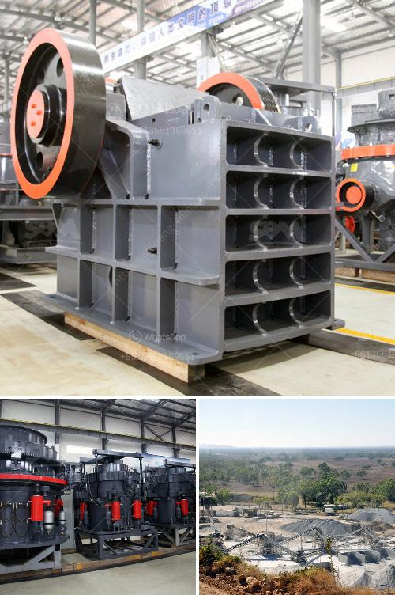

<h3>cost of ball mill 40tonns capacity</h3>
A ball mill is a type of grinder used to grind materials into extremely fine powder for use in mineral dressing processes, paints, pyrotechnics, ceramics, and selective laser sintering. The soaring demand for construction materials and raw materials necessitates the utilization of efficient grinding machinery such as ball mills. When considering the cost of a ball mill with a 40-tonne capacity, several factors come into play. These include the initial investment, the operating costs, and the maintenance expenses.

The initial investment in a ball mill is influenced by several factors. The main factor is the capacity of the mill, with larger capacity mills generally being more expensive. A ball mill with a 40-tonne capacity will typically cost between $500,000 and $1 million. The exact cost will depend on the design features, such as the length and diameter of the mill, the grinding media used, and the lining materials.

Operating costs also need to be considered when assessing the cost of a ball mill. These costs include the energy consumption required to rotate the mill, as well as the cost of the grinding media and any necessary additives. The power consumption of a ball mill depends on its size and the hardness of the material being ground. Generally, larger mills will consume more power. On average, the energy consumption of a 40-tonne capacity mill will be around 1000 kWh per tonne of feed material. Assuming an energy cost of $0.10 per kWh, the energy cost per tonne of feed material will be around $100.

Maintenance costs are another factor to take into account. All mechanical equipment requires regular maintenance to ensure optimal performance and longevity. The maintenance costs associated with a ball mill include the cost of routine inspections, lubrication, and replacement of worn parts. The frequency and extent of maintenance will depend on various factors such as the type of material being ground and the operating conditions. As a rough estimate, the annual maintenance costs for a ball mill with a 40-tonne capacity will be around $50,000 to $100,000.

Overall, the cost of a ball mill with a 40-tonne capacity will range from $500,000 to $1 million, taking into consideration the initial investment, operating costs, and maintenance expenses. It is important to keep in mind that these figures are rough estimates and can vary depending on various factors such as the geographical location and the supplier of the equipment.

In conclusion, a ball mill with a 40-tonne capacity can be a significant investment for any company involved in the grinding of materials. However, the benefits of using a ball mill for efficient grinding can outweigh the initial investment. By carefully evaluating the initial investment, operating costs, and maintenance expenses, a company can make an informed decision on whether acquiring a ball mill is a viable option for their specific needs.
<h3>Contact us</h3><ul><li><strong>Whatsapp:&nbsp;<a href="https://wa.me/8613661969651">+8613661969651</a></strong></li><li><a href="https://swt.shibang-china.com/?git&amp;zhl&amp;cost of ball mill 40tonns capacity"><strong>Online Service(chat now)</strong></a></li></ul><h3>Related</h3><ul><li><a href='quartz processing technique.md'>quartz processing technique</a></li><li><a href='crusher machine in gujranwala location.md'>crusher machine in gujranwala location</a></li><li><a href='small concrete crusher.md'>small concrete crusher</a></li><li><a href='silica sand crusher in ghana.md'>silica sand crusher in ghana</a></li><li><a href='iron ore beneficiation plant.md'>iron ore beneficiation plant</a></li></ul>