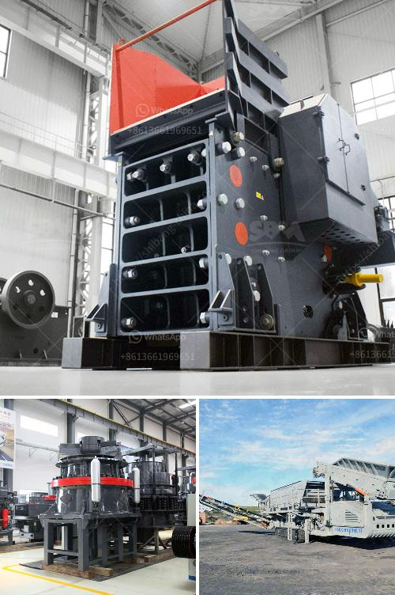

<h3>cost of clinker grinding and cement plant</h3>
The cement industry is an important driver of economic development globally. The cost of producing cement has significantly risen over the years due to various factors including energy costs, raw material availability, and market demand. One of the key processes involved in cement production is clinker grinding.

Clinker refers to the nodules produced by sintering limestone and alumino-silicate materials such as clay during the cement kiln stage. Clinker is then ground with gypsum to produce cement. Since clinker is a key ingredient in cement production, grinding it significantly impacts the overall cost of the cement.

The clinker grinding process is conducted in a closed loop system which includes a mill, separator, and elevator. The grinding is done in ball mills, which are cylindrical vessels filled with a certain amount of grinding media such as steel balls.

The process consumes a large amount of energy, and the raw materials used in grinding, such as limestone and gypsum, require additional energy inputs. Therefore, the cost of clinker grinding and cement plant can be substantial.

Several factors contribute to the cost of clinker grinding and cement plant. First and foremost, energy costs are a significant component of this process. Grinding mills require a large amount of electricity to operate, especially during the initial grinding stage when the raw materials are harder.

Moreover, the grinding process itself consumes a large amount of energy. The size and type of grinding media used also impact the electricity consumption. Steel balls are the most commonly used grinding media and are relatively expensive. The cost of replacing worn-out grinding media can add to the overall cost.

Another major cost factor is the raw material required for clinker grinding. The availability and cost of limestone and gypsum, the primary materials, can vary depending on the local market conditions. Transportation costs associated with sourcing these materials can also impact the overall cost.

Additionally, maintenance and operational costs should be considered. Grinding mills require regular maintenance to ensure optimal performance. This includes replacing worn-out parts, lubrication, and inspection. Furthermore, the overall efficiency and capacity of the grinding mill can also affect the cost.

The scale of the cement plant also plays a role in determining the cost of clinker grinding. Larger plants generally have greater economies of scale, which can result in lower costs per unit of production. However, constructing and operating a large-scale plant may require significant upfront investments.

Despite the high cost of clinker grinding and cement plant setup, it is economically viable due to the strong demand for cement in the construction industry. The cost can be mitigated by optimizing the grinding process, using alternative fuels or raw materials, and implementing energy-saving measures.

In conclusion, the cost of clinker grinding and cement plant is influenced by various factors, including energy costs, raw material availability, and plant scale. Despite these challenges, the cement industry continues to thrive due to the immense demand for cement in the construction sector. With continuous innovations and investments in efficiency, the cost of cement production can be effectively managed.
<h3>Contact us</h3><ul><li><strong>Whatsapp:&nbsp;<a href="https://wa.me/8613661969651">+8613661969651</a></strong></li><li><a href="https://swt.shibang-china.com/?git&amp;zhl&amp;cost of clinker grinding and cement plant"><strong>Online Service(chat now)</strong></a></li></ul><h3>Related</h3><ul><li><a href='crusher machine plant estimation cost.md'>crusher machine plant estimation cost</a></li><li><a href='ball milling in spray preparation.md'>ball milling in spray preparation</a></li><li><a href='100tph stone crusher price list.md'>100tph stone crusher price list</a></li><li><a href='vertical ball mill with price.md'>vertical ball mill with price</a></li><li><a href='ball mill for gold in south africa.md'>ball mill for gold in south africa</a></li></ul>