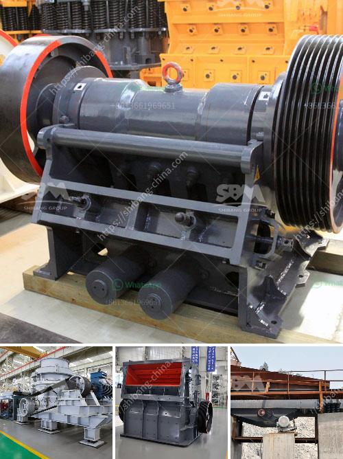

<h3>cost of crusher machine for grinding mica</h3>
The cost of crusher machines for grinding mica is a key consideration for any industrial company looking to streamline their operations and improve profitability. The sheer number of options available in the market can be overwhelming, but by understanding your specific needs and budget constraints, you can make an informed decision.

Mica is a naturally occurring mineral used in various industries such as cosmetics, paint, plastics, and electronics. It is primarily used as an additive to enhance the properties of these products. To fulfill this demand, companies require crusher machines that can efficiently and effectively grind mica into the desired fine powder.

One of the most important factors to consider when purchasing a crusher machine for grinding mica is its cost. The cost will vary depending on the machine's size, capacity, and features. However, investing in a high-quality and reliable machine can result in long-term cost savings and increased productivity.

The first cost consideration is the initial purchase price of the crusher machine. Generally, machines that can handle larger volumes of mica tend to be more expensive. If your production requirements are relatively small, opting for a smaller machine with a lower capacity can be a cost-effective solution. However, if the volume of mica you need to grind is high, a larger machine might be more suitable.

Apart from the purchase price, ongoing maintenance and operating costs should also be taken into account. Some crusher machines require more frequent maintenance than others, which can add up to significant expenses over time. It is important to consider the availability and cost of spare parts, as well as the overall reliability and durability of the machine, to ensure minimal downtime and maximum efficiency.

Energy consumption is another crucial factor to consider when assessing the cost of crusher machines. Energy-efficient machines can result in significant savings in electricity bills, making them more cost-effective in the long run. Look for machines with energy-saving features, such as efficient motors and advanced control systems, to optimize your energy consumption and reduce operating costs.

Additionally, it can be beneficial to consider the level of automation and technology incorporated into the crusher machine. Automated machines can improve productivity and reduce labor costs by requiring fewer manual interventions. Furthermore, advanced technologies, such as remote monitoring and data analytics, can provide valuable insights into machine performance and maintenance needs, leading to cost savings and optimized operations.

In conclusion, the cost of crusher machines for grinding mica can vary depending on various factors such as size, capacity, energy consumption, and level of automation. While it may be tempting to opt for the lowest-priced option, it is crucial to carefully consider your specific needs and long-term goals. Investing in a high-quality machine that meets your requirements will ultimately result in increased productivity, reduced downtime, and improved profitability.
<h3>Contact us</h3><ul><li><strong>Whatsapp:&nbsp;<a href="https://wa.me/8613661969651">+8613661969651</a></strong></li><li><a href="https://swt.shibang-china.com/?git&amp;zhl&amp;cost of crusher machine for grinding mica"><strong>Online Service(chat now)</strong></a></li></ul><h3>Related</h3><ul><li><a href='stone crushing process.md'>stone crushing process</a></li><li><a href='marble crusher equipment.md'>marble crusher equipment</a></li><li><a href='gypsum import from bhutan.md'>gypsum import from bhutan</a></li><li><a href='closs size setting jaw crusher.md'>closs size setting jaw crusher</a></li><li><a href='marble granite stone grinding machine price.md'>marble granite stone grinding machine price</a></li></ul>