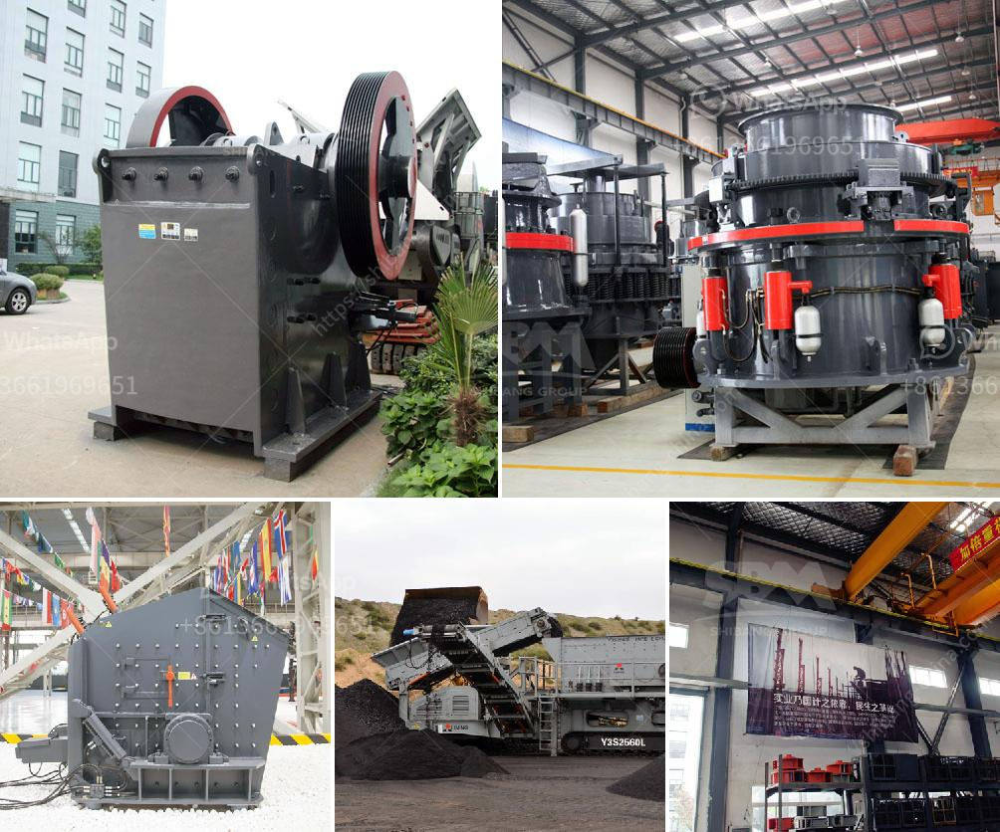

<h3>cost of crusher machine kenya</h3>
The cost of crusher machines in Kenya is low due to the availability of many suppliers and competition among them. The cost of the specific crusher machine will also vary depending on the application, production capacity, model, and brand. However, the most important thing to note is that the cost of a crusher machine in Kenya always stays affordable because of its diverse features.

Crusher machines are used to break large stones, rocks, and other solid materials into smaller pieces in construction, mining, and other industries. These machines are commonly found in quarries and mines where their main purpose is to crush rocks into smaller sizes for further processing. They are also used in road construction and other applications where materials need to be crushed and sorted efficiently.

The cost of a crusher machine in Kenya can range from thousands of dollars to hundreds of thousands of dollars depending on the type, capacity, and brand. However, the price of the machine is not the only factor to consider when purchasing a crusher machine. Other factors to consider include the design, reliability, ease of maintenance, and availability of spare parts for the machine.

One important factor that impacts the cost of a crusher machine in Kenya is the capacity or production capacity of the machine. A high-capacity crusher machine will have a higher cost compared to a machine with a lower capacity. This is because a higher capacity machine requires more power and heavier components to handle the larger material feed.

Another factor that affects the cost of a crusher machine in Kenya is the model and brand of the machine. Different brands and models of crusher machines have varying prices due to differences in quality, performance, and features. Some well-known brands may have a higher price tag compared to lesser-known brands, but they often come with better reliability and after-sales support.

It is advisable to compare prices and features of different crusher machines before making a purchase. This can be done by visiting different suppliers, reading online reviews, and consulting experts in the industry. By doing thorough research, buyers can get the best value for their money and ensure that they are investing in a crusher machine that meets their specific requirements.

In conclusion, the cost of a crusher machine in Kenya is relatively low compared to other countries due to the availability of suppliers and competition. However, it is important to consider other factors such as capacity, model, and brand when purchasing a crusher machine. By doing so, buyers can ensure that they are getting the best value for their money and a machine that meets their needs.
<h3>Contact us</h3><ul><li><strong>Whatsapp:&nbsp;<a href="https://wa.me/8613661969651">+8613661969651</a></strong></li><li><a href="https://swt.shibang-china.com/?git&amp;zhl&amp;cost of crusher machine kenya"><strong>Online Service(chat now)</strong></a></li></ul><h3>Related</h3><ul><li><a href='industrial application of ball mills.md'>industrial application of ball mills</a></li><li><a href='cost of clinker grinding and cement plant.md'>cost of clinker grinding and cement plant</a></li><li><a href='mobile plant sand screen for sale.md'>mobile plant sand screen for sale</a></li><li><a href='nigeria grinding mills price.md'>nigeria grinding mills price</a></li><li><a href='gypsum machine in germany.md'>gypsum machine in germany</a></li></ul>