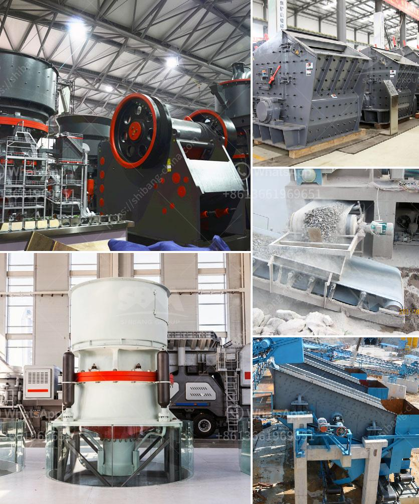

<h3>cost of grinding machine</h3>
The cost of grinding machine is an important consideration when purchasing one for your business or workshop. In today's highly competitive market, businesses are constantly looking for ways to cut costs and increase efficiency. Grinding machines play a vital role in achieving these objectives, as they are used in various industries for grinding materials such as metal, ceramics, and glass.

The cost of a grinding machine will vary depending on factors such as the machine's capacity, power requirements, and the type of grinding tasks it can perform. The larger and more powerful machines are generally more expensive, but they also offer higher productivity and efficiency. Some advanced grinding machines are equipped with automation features that further enhance their performance and reduce operational costs.

The capacity of a grinding machine refers to the amount of material it can process in a given time period. Machines with higher capacity are typically larger and more expensive. However, they allow businesses to process larger batches of material, which can lead to greater cost savings over time. For instance, if your business requires grinding large quantities of material on a regular basis, investing in a high-capacity machine may be the most cost-effective option in the long run.

Another factor that influences the cost of a grinding machine is the power requirements. More powerful machines often consume more electricity, which can increase operational costs. However, these machines are also capable of grinding materials at a faster rate, leading to higher productivity. It is essential to consider your business's specific needs and balance the power requirements with the operational costs to determine the most cost-effective machine for your operation.

Furthermore, the type of grinding tasks the machine can perform also affects its cost. Different industries have different requirements when it comes to grinding materials. For example, some machines are designed specifically for metal grinding, while others are more suitable for ceramic or glass grinding. Machines equipped with additional features and specialized grinding wheels for specific materials may be more expensive. However, investing in the right machine for your specific application can lead to better quality results and cost savings in the long term.

When evaluating the cost of a grinding machine, it is important to consider both the initial purchase price and the long-term operating costs. While a low-cost machine may seem appealing, it may not deliver the desired performance or have higher maintenance expenses. On the other hand, a higher-priced machine may offer better durability and require less frequent repairs, resulting in lower maintenance costs over time.

In conclusion, the cost of a grinding machine is determined by a combination of factors including capacity, power requirements, and the type of grinding tasks it can perform. When making a purchasing decision, it is crucial to assess your business's specific needs and balance the initial investment with long-term operating costs. Investing in a high-quality grinding machine tailored to your requirements can ultimately lead to improved productivity, efficiency, and cost savings for your business.
<h3>Contact us</h3><ul><li><strong>Whatsapp:&nbsp;<a href="https://wa.me/8613661969651">+8613661969651</a></strong></li><li><a href="https://swt.shibang-china.com/?git&amp;zhl&amp;cost of grinding machine"><strong>Online Service(chat now)</strong></a></li></ul><h3>Related</h3><ul><li><a href='ethiopia unused cone crusher for sale.md'>ethiopia unused cone crusher for sale</a></li><li><a href='best machine brands for quarry.md'>best machine brands for quarry</a></li><li><a href='ball mills for measured mining.md'>ball mills for measured mining</a></li><li><a href='barite machinery production plant.md'>barite machinery production plant</a></li><li><a href='crusher stone crusher 1 ton peru.md'>crusher stone crusher 1 ton peru</a></li></ul>