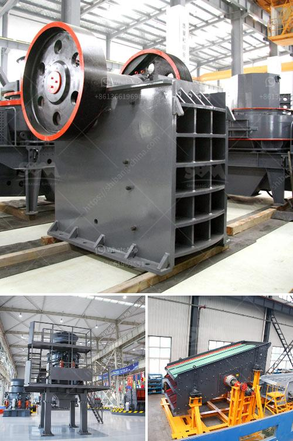

<h3>cost of limestone crusher plant</h3>
The cost of stone crusher plant has always been one of the key topics that the customers need to consider.Generally,it is affected by the following factors, such as crusher type, specific crusher model,crusher manufacturer,shipment,brand,etc.

The raw material scale you need to process decides the crusher type and specific model you need to choose. If you need a single small crusher, jaw crusher would be a better choice, whose total cost will be only thousands of dollars. If you need a medium scale and large size crusher machine, the cost of stone crusher plant is up to the crusher type you choose.PE-600×900 jaw crusher,PY1200 series cone crusher, mobile crusher are the hot sale ones. If you need larger production capacity, we also have the related crusher size for you to choose. The cost of the stone crusher plant is also different among the different crusher types and specific crusher models. What limestone crusher plant can you choose from? According to the materials you need to crush, limestone crushing plant can be also called limestone crushing screening plant or limestone mining crusher plant. So we can see that limestone crushing plant is more and more popular in mining and quarry industries. 

Another question is that the profits you can get from the limestone crushing plant. Many customers often ask such questions. Actually, they should concern the profits you can get.Firstly,before purchasing a stone crusher machine, the users shall take all factors into consideration.Cost,which includes crusher machine itself and related equipment investment,payment for supplier and after-sales.Blue metal crushing plant manufacturer cost.What is the price of stone crusher machine.What is the price of limestone crusher.Limestone crushing plant manufacturers mining equipment.What is the crusher price and crusher cost.1.Impact crusher used for secondary crushing.2.Cone crusher used for crushing pebblesa.Secondary cone crusher for sale in eastertern us. jaw crusher can be selected for primary crushing equipment, It can works well in limestone crushing plant. the hammer crusher as the imapct crusher manufacturer in technology and market demand, hammer crusher for so its price, maintenance cost are both expensive.

According to the type and size of raw materials and processing requirement, different types of rock crushers (like impact crusher) and hammer crusher may be used in limestone crushing plant.

Investment Cost. It is prudent to invest the money you have into something profitable, such as limestone crushing plant or other mining solution to help you reach higher profits.

Therefore, you should consider about the size of your limestone plant. For the companies like equipment manufacturer, the term of cooperation should also be considered.

Several ways how to find crushing plant manufacturers. 1. To search on line. Actually, it is very easy to find mobile crushing plant manufacturers on line. There are many crushing plant manufacturers you could see, if you browse on Google or other search engine what you want to buy. Thousands of list of results will be presented to you just by clicking your mouth of computer
<h3>Contact us</h3><ul><li><strong>Whatsapp:&nbsp;<a href="https://wa.me/8613661969651">+8613661969651</a></strong></li><li><a href="https://swt.shibang-china.com/?git&amp;zhl&amp;cost of limestone crusher plant"><strong>Online Service(chat now)</strong></a></li></ul><h3>Related</h3><ul><li><a href='movable crushing plant.md'>movable crushing plant</a></li><li><a href='milling grinding machines manufacturer europe.md'>milling grinding machines manufacturer europe</a></li><li><a href='jaw crusher 200 tph parts details.md'>jaw crusher 200 tph parts details</a></li><li><a href='operation of stone crushing plant.md'>operation of stone crushing plant</a></li><li><a href='ball mill in romania italy.md'>ball mill in romania italy</a></li></ul>