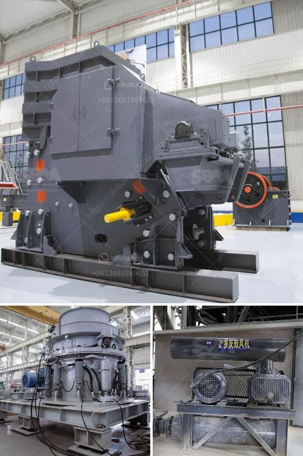

<h3>cost of manganese beneficiation plant</h3>
The cost of manganese beneficiation plant plays a crucial role in the development of the manganese industry around the world. As a vital raw material in steel production, manganese is essential to the economic growth and stability of several countries. With its increasing demand globally, the establishment of beneficiation plants has become a significant investment for many mining companies.

Beneficiation is the process of extracting valuable minerals from their ores, which includes enhancing their quality and purity. In the case of manganese, the beneficiation process aims to separate and concentrate the valuable manganese mineral from the impurities present in the ore. This allows for the production of high-quality manganese concentrate, which can then be further processed into various manganese-based products, such as ferroalloys, batteries, and steel.

The cost of establishing a manganese beneficiation plant varies depending on several factors, including the capacity of the plant, the type of ore being processed, and the location of the plant. Generally, a typical manganese beneficiation plant with a capacity of 300-500 tons per day can range from $5 million to $30 million. However, these figures can vary significantly based on the specific requirements of the project.

Some of the major cost components involved in the establishment of a manganese beneficiation plant include:

1. Site selection and land acquisition: The location of the plant plays a crucial role in determining the cost. The availability of suitable land, proximity to the ore deposits, infrastructure facilities, and environmental considerations are key factors in site selection.

2. Infrastructure and utilities: The development of supporting infrastructure, such as power supply, water sources, transportation, and communication networks, adds to the overall cost of the project. These infrastructure requirements are vital for the smooth functioning of the plant.

3. Equipment and machinery: Procuring state-of-the-art equipment and machinery necessary for the beneficiation process contributes significantly to the cost. This includes crushers, screens, scrubbers, magnetic separators, and various other processing units.

4. Labor and operational expenses: Hiring skilled laborers, engineers, and technicians adds to the operational cost. Additionally, ongoing maintenance, repair, and replacement expenses of the machinery and equipment need to be considered.

5. Environmental and regulatory compliance: Compliance with environmental regulations and obtaining necessary permits and licenses incur costs. The implementation of pollution control measures and waste management systems are essential factors to be considered during the plant design and construction.

Besides the initial investment, operating costs, including energy consumption, chemical reagents, consumables, and waste disposal, also need to be considered. Furthermore, the profitability of the plant depends on various factors, such as market demand, selling price, production efficiency, and the quality of the final product.

The establishment of a manganese beneficiation plant offers significant economic and environmental benefits. It not only creates employment opportunities but also contributes to the overall growth of the mining and steel industries. Moreover, by improving the quality of manganese concentrate, beneficiation plants enable the production of high-grade steel, reducing the reliance on imported manganese ores.

In conclusion, the cost of establishing a manganese beneficiation plant can vary based on several factors, including the plant's capacity, ore quality, and location. Mining companies and investors need to carefully assess these factors to make informed decisions regarding the establishment of such plants. However, despite the initial investment, the long-term benefits of establishing beneficiation plants are immense, leading to sustainable growth and development of the manganese industry.
<h3>Contact us</h3><ul><li><strong>Whatsapp:&nbsp;<a href="https://wa.me/8613661969651">+8613661969651</a></strong></li><li><a href="https://swt.shibang-china.com/?git&amp;zhl&amp;cost of manganese beneficiation plant"><strong>Online Service(chat now)</strong></a></li></ul><h3>Related</h3><ul><li><a href='crushing plant and equipment.md'>crushing plant and equipment</a></li><li><a href='used hammer mill for sale.md'>used hammer mill for sale</a></li><li><a href='jaw crusher south africa used.md'>jaw crusher south africa used</a></li><li><a href='buy a cement blending plant in south africa.md'>buy a cement blending plant in south africa</a></li><li><a href='project proposal for gypsum manufacturing.md'>project proposal for gypsum manufacturing</a></li></ul>