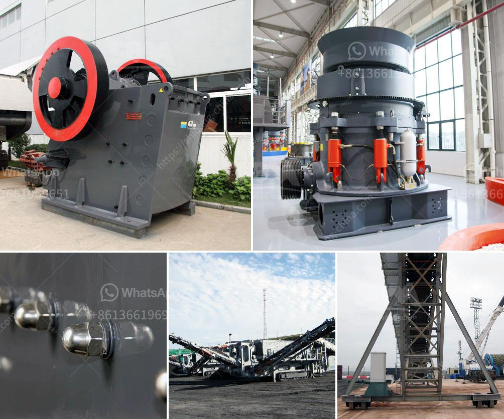

<h3>cost of starting a quarry business</h3>
Starting a quarry business is a profitable venture that requires a lot of strategic planning. And the good news is that it doesn't necessarily require an exorbitant budget. In fact, the cost of setting up a quarry business can be minimal if done effectively. With the right protocols in place, a flourishing quarrying operation can be established with a moderate investment.

One of the primary costs incurred when starting a quarry business is the cost of acquiring the land. Depending on the location and size of the quarry, land can be relatively affordable or expensive. It's essential to conduct thorough research to find a suitable location that adheres to local regulations while also being conducive to quarrying operations.

Another significant cost to consider is the machinery and equipment needed to extract and process the desired materials. This includes the cost of purchasing or leasing heavy-duty trucks, excavators, loaders, crushers, and other necessary equipment. It's crucial to invest wisely in machinery that is durable, efficient, and capable of meeting production demands.

Additionally, hiring skilled workers is key to running an efficient and successful quarry business. Though labor costs can vary depending on the region, it's essential to recruit employees with the necessary expertise in quarrying and mining operations. Employing trained personnel ensures smooth operations and helps prevent costly mistakes and accidents.

Other crucial expenses when starting a quarry business include obtaining the necessary permits and licenses, complying with environmental regulations, and investing in safety measures and equipment. It's crucial to prioritize safety and ensure the well-being of both workers and the surrounding community.

Overall, the cost of starting a quarry business can range from moderate to considerable, depending on various factors like location, size, and scope of operations. With meticulous planning, strategic investments, and adherence to regulatory requirements, a quarry business can be established successfully within a reasonable budget. Moreover, with careful management and the fulfillment of demand, this venture has the potential to generate substantial profits over time.
<h3>Contact us</h3><ul><li><strong>Whatsapp:&nbsp;<a href="https://wa.me/8613661969651">+8613661969651</a></strong></li><li><a href="https://swt.shibang-china.com/?git&amp;zhl&amp;cost of starting a quarry business"><strong>Online Service(chat now)</strong></a></li></ul><h3>Related</h3><ul><li><a href='vertical ball mill with price.md'>vertical ball mill with price</a></li><li><a href='rodillos para trituradoras en bogota.md'>rodillos para trituradoras en bogota</a></li><li><a href='coal crusher supplier.md'>coal crusher supplier</a></li><li><a href='rock crusher china.md'>rock crusher china</a></li><li><a href='quartz ball for ball mill.md'>quartz ball for ball mill</a></li></ul>