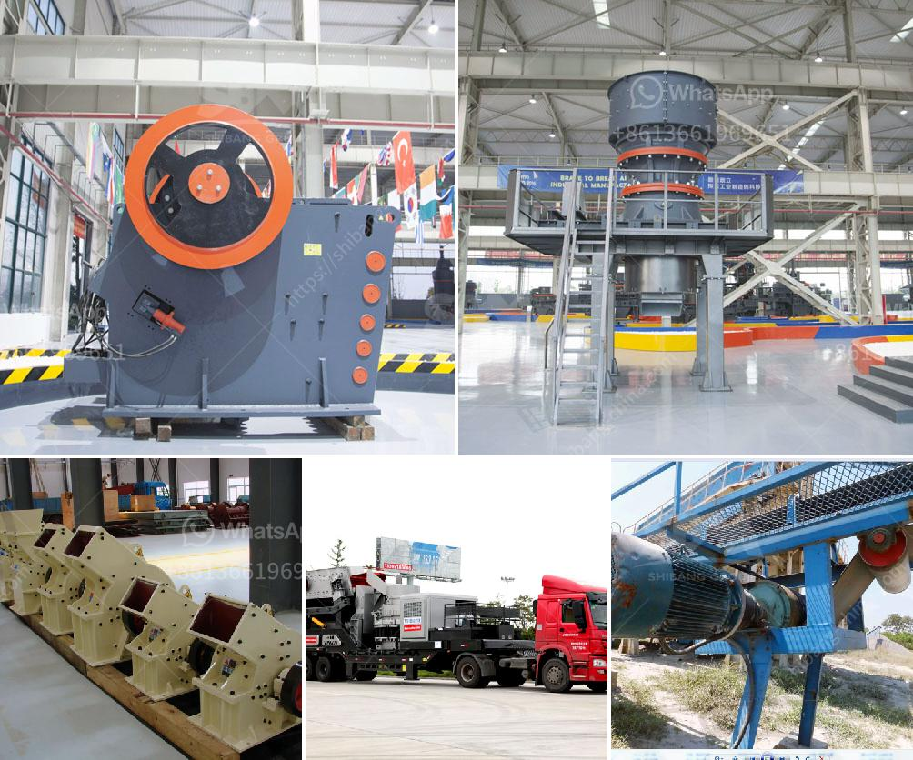

<h3>cost on vsi crusher</h3>
Vertical shaft impact (VSI) crushers have gained popularity over the years due to their ability to produce cubical-shaped particles of different sizes. This versatile crusher is widely used in various industries, including mining, construction, cement, and aggregate production. However, before investing in a VSI crusher, it is essential to understand the cost implications associated with the equipment. In this article, we will delve into the various cost factors of owning and operating a VSI crusher.

The price of a VSI crusher varies depending on the model, capacity, and brand. Generally, the larger the capacity and higher the performance, the higher the initial investment. Premium brands may also come at a higher cost, but they often offer better durability, reliability, and customer service, reducing potential downtime and maintenance costs in the long run.

Operating and maintenance costs associated with VSI crushers include energy consumption, wear parts replacement, and regular maintenance. VSI crushers consume electrical energy to rotate the rotor and operate the high-speed rock-on-rock crushing process. The energy consumption may vary depending on the feed size, material hardness, and required particle size distribution.

Wear parts, such as rotor tips, anvils, and distributor plates, experience gradual wear during the crushing process. Regular replacement of these parts is crucial for maintaining optimal performance. The frequency of wear part replacements depends on factors such as material abrasiveness, feed size, and crusher settings.

Regular maintenance is also necessary to ensure the longevity and reliability of the VSI crusher. This may include checking and adjusting the crusher's velocity, monitoring the lubrication system, inspecting the wear parts, and cleaning the crusher's internal components. Neglecting regular maintenance can lead to increased downtime and costly repairs.

The output and product quality achieved by a VSI crusher can impact its cost-effectiveness. VSI crushers are typically used to produce cubical-shaped particles, which are highly valued in the construction and concrete industries. If a VSI crusher fails to deliver the desired product quality, it may result in additional costs, such as re-crushing or using additional screening processes. Therefore, it is essential to select a VSI crusher with the right configuration and capabilities to meet your specific requirements.

Operational flexibility is another crucial factor to consider when evaluating the cost of a VSI crusher. Some models offer adjustable rotor speed and cascade ratio, allowing the crusher to adapt to varying material properties and applications. This flexibility can enhance the overall efficiency and versatility of the crusher, potentially reducing operational costs.

In conclusion, the cost of investing in a VSI crusher goes beyond the initial purchase price. Understanding the associated operating and maintenance costs, output and product quality, and operational flexibility is crucial for making an informed decision. It is advisable to consult with manufacturers, conduct thorough cost-benefit analyses, and consider long-term benefits to ensure the chosen VSI crusher aligns with your goals and budget.
<h3>Contact us</h3><ul><li><strong>Whatsapp:&nbsp;<a href="https://wa.me/8613661969651">+8613661969651</a></strong></li><li><a href="https://swt.shibang-china.com/?git&amp;zhl&amp;cost on vsi crusher"><strong>Online Service(chat now)</strong></a></li></ul><h3>Related</h3><ul><li><a href='stone crusher pricetonnes capacity per hour.md'>stone crusher pricetonnes capacity per hour</a></li><li><a href='bauxite crusher manufacturer.md'>bauxite crusher manufacturer</a></li><li><a href='mining conveyors for sale in zimbabwe.md'>mining conveyors for sale in zimbabwe</a></li><li><a href='used silica crushing plants for sale.md'>used silica crushing plants for sale</a></li><li><a href='mill price hammer mill.md'>mill price hammer mill</a></li></ul>