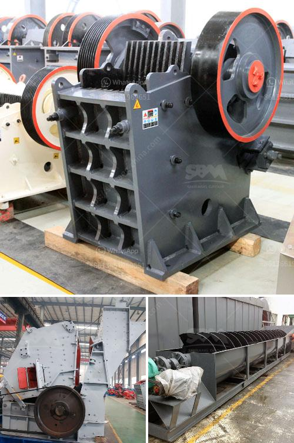

<h3>cost setting up limestone mine</h3>
Limestone is a sedimentary rock composed mainly of calcium carbonate (CaCO3). Limestone deposits are abundant worldwide, making mining and processing this mineral resource a lucrative venture for many countries. The cost of setting up a limestone mine can vary greatly, primarily depending on the scale of the mine, the location, and the quality of the limestone deposits.

To start a limestone mining project, certain aspects must be considered, such as permitting, geological reports, mine design, equipment selection, and mining methods. Depending on the deposit's size and characteristics, the cost of setting up a limestone mine can range from a few hundred thousand dollars to several million.

First and foremost, a detailed geological study and report are essential to understand the deposit's quality, location, and potential. This normally involves hiring a team of geologists and experts to assess the deposit and provide a thorough report. A comprehensive geological study can cost anywhere from $50,000 to $100,000, depending on the complexity and size of the deposit.

Once the geology is understood, the next step is obtaining the necessary permits and licenses from local authorities. This typically involves environmental impact assessments, land acquisition or leasing, reclamation plans, and acquiring necessary permissions. The cost of obtaining permits and licenses can vary significantly depending on the location and regulatory requirements, ranging from $50,000 to several hundred thousand dollars.

After obtaining the necessary permits, mine design and planning become crucial. This includes selecting the appropriate mining methods, determining the mine's layout, and designing infrastructure such as access roads, haulage routes, and waste management facilities. Mine design and planning can cost around $100,000 to $300,000, depending on the scale and complexity of the project.

Equipment selection is another major cost consideration when setting up a limestone mine. This includes purchasing or leasing heavy machinery such as excavators, loaders, trucks, and crushers. The cost of equipment can vary depending on their size, capacity, and quality. A modest limestone mining operation may require equipment costing only a few million dollars, while a larger operation can easily exceed $10 million.

Infrastructure development is another crucial aspect to consider. This includes constructing roads, power supply lines, water management systems, and other amenities required to support the mining operation. Depending on the location and its proximity to existing infrastructure, the cost of developing necessary infrastructure can range from a few hundred thousand dollars to several million.

Lastly, ongoing operational costs should also be factored in. This includes labor, maintenance and repair expenses, fuel, and other consumables. The ongoing operational costs can add up over time and must be accounted for when determining the project's overall feasibility.

In conclusion, setting up a limestone mine involves various cost considerations. These may include geological studies, permitting and licensing, mine design, equipment selection, infrastructure development, and ongoing operational costs. The total cost of setting up a limestone mine can range from a few hundred thousand dollars to several million. It is essential to conduct a thorough analysis and feasibility study to determine the potential profitability of the operation before committing significant resources.
<h3>Contact us</h3><ul><li><strong>Whatsapp:&nbsp;<a href="https://wa.me/8613661969651">+8613661969651</a></strong></li><li><a href="https://swt.shibang-china.com/?git&amp;zhl&amp;cost setting up limestone mine"><strong>Online Service(chat now)</strong></a></li></ul><h3>Related</h3><ul><li><a href='ball mill for gold in south africa.md'>ball mill for gold in south africa</a></li><li><a href='hammer vibrating screens usa.md'>hammer vibrating screens usa</a></li><li><a href='used silica crushing plants for sale.md'>used silica crushing plants for sale</a></li><li><a href='mining equipment hire indonesia.md'>mining equipment hire indonesia</a></li><li><a href='ton gold wash plant for sale.md'>ton gold wash plant for sale</a></li></ul>