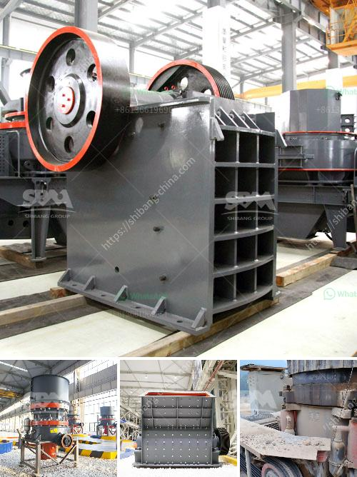

<h3>crush cobble machine</h3>
Innovation and automation have always been the driving forces behind human progress. Industries and businesses are constantly striving to find more efficient ways to accomplish tasks that were once labor-intensive and time-consuming. In line with this quest, the Crush Cobble Machine is emerging as a game-changer in stone extraction processes. This revolutionary technology promises to transform the industry, offering unparalleled efficiency, reduced labor costs, and increased productivity.

Traditionally, stone extraction has required extensive manual labor. Workers would painstakingly break down large rocks into smaller pieces by hand, resulting in slow and exhausting progress. The introduction of the Crush Cobble Machine changes the landscape entirely. This automated solution crushes cobblestones into desired sizes with remarkable speed and precision, eliminating the need for labor-intensive manual efforts. This breakthrough technology minimizes both the physical strain on workers and the cost implications of employing a large workforce.

By replacing manual labor, the Crush Cobble Machine offers significant cost-saving benefits for businesses in the stone extraction industry. Companies can significantly reduce their operational expenses, as the need for a large number of field workers is greatly reduced. Additionally, the machine's efficient crushing process minimizes waste and preserves the quality of extracted stones, preventing unnecessary loss and unnecessary financial burden.

The Crush Cobble Machine not only enhances efficiency but also significantly increases productivity in the stone extraction process. With traditional methods, extraction rates were limited by the number of laborers available and their physical endurance. The automated nature of this machine eliminates these limitations, allowing businesses to achieve higher output levels. This increased productivity enables stone extraction companies to fulfill larger contracts and meet growing demands in the market while maximizing their profit potential.

In addition to its economic benefits, the Crush Cobble Machine also represents a positive step forward in terms of environmental sustainability. Traditional stone extraction methods involve the use of heavy machinery, which emits harmful greenhouse gases and contributes to pollution. However, this machine operates on energy-efficient mechanisms, reducing the overall carbon footprint of the process. Moreover, the elimination of manual labor reduces the strain on the environment, as less physical effort means fewer resources consumed.

The emergence of the Crush Cobble Machine is not only a significant advancement for the stone extraction industry but also a testament to the endless possibilities of automation and innovation. As technology continues to evolve, it is expected that further advancements and improvements will be made, making the extraction process even more efficient, eco-friendly, and cost-effective. These developments will undoubtedly shape the future of stone extraction, offering businesses a more streamlined and sustainable way of operations.

The Crush Cobble Machine represents a remarkable breakthrough in the stone extraction industry. By revolutionizing the traditional labor-intensive process, this technology offers enhanced efficiency, reduced costs, increased productivity, and positive environmental impacts. With its ability to transform the way stones are extracted, crushed, and utilized, the machine holds tremendous potential for the industry and a promising future ahead. As businesses embrace this automated solution, the stone extraction industry is set to witness a new era of progress and prosperity.
<h3>Contact us</h3><ul><li><strong>Whatsapp:&nbsp;<a href="https://wa.me/8613661969651">+8613661969651</a></strong></li><li><a href="https://swt.shibang-china.com/?git&amp;zhl&amp;crush cobble machine"><strong>Online Service(chat now)</strong></a></li></ul><h3>Related</h3><ul><li><a href='stone crusher made in italy.md'>stone crusher made in italy</a></li><li><a href='mobile rock crusher.md'>mobile rock crusher</a></li><li><a href='roller mill malaysia.md'>roller mill malaysia</a></li><li><a href='barium carbonate manufacturing process.md'>barium carbonate manufacturing process</a></li><li><a href='stone crusher machine price in pakistan.md'>stone crusher machine price in pakistan</a></li></ul>