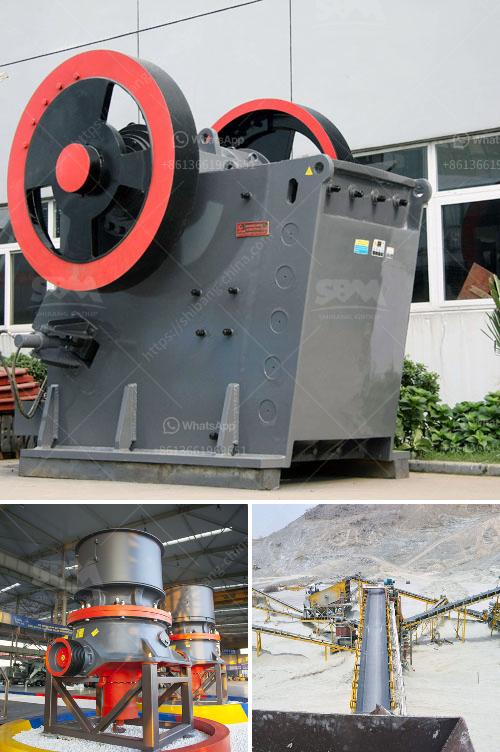

<h3>crushed stone products mwanza tanzania</h3>
Crushed stone products are essential for the construction industry in Mwanza, Tanzania. As Mwanza's population grows and infrastructure development projects increase, the demand for aggregates like crushed stones is also on the rise. This article aims to shed light on the importance of crushed stone products in the region.

Crushed stone products, such as gravel and granite, are durable and versatile materials that are widely used in various construction projects. They serve as the foundation for roads, walkways, buildings, and other structures. The superior strength and stability of crushed stone make it an ideal choice for both residential and commercial applications.

The availability of crushed stone products in Mwanza plays a crucial role in the development of the local construction industry. With numerous ongoing and upcoming projects, such as road expansions, building constructions, and infrastructure developments, the need for high-quality aggregates is paramount.

Not only is crushed stone a reliable and dependable building material, but it also offers aesthetic value to the projects. The various colors and sizes of crushed stones available in Mwanza allow for creative and visually appealing designs. From small pebbles to larger stones, there is a wide range of options to choose from, depending on the specific requirements of the project.

Moreover, crushed stone is cost-effective compared to other construction materials. Its availability locally ensures lower transportation costs, leading to more affordable construction projects. This makes it accessible to a larger number of contractors and individuals, further contributing to the growth of the local construction industry.

In Mwanza, Tanzania, there are various suppliers and distributors that offer high-quality crushed stone products. These companies ensure that the materials meet the required specifications and are suitable for the intended use. It is crucial for contractors and individuals to source their crushed stone products from reputable suppliers to ensure a reliable and durable end result.

In conclusion, crushed stone products are vital for the construction industry in Mwanza, Tanzania. They provide a strong foundation, enhance aesthetics, and offer cost-effective solutions for various building projects. The availability of high-quality crushed stone products in the region supports the growth and development of the local construction industry.
<h3>Contact us</h3><ul><li><strong>Whatsapp:&nbsp;<a href="https://wa.me/8613661969651">+8613661969651</a></strong></li><li><a href="https://swt.shibang-china.com/?git&amp;zhl&amp;crushed stone products mwanza tanzania"><strong>Online Service(chat now)</strong></a></li></ul><h3>Related</h3><ul><li><a href='the production process of cobblestone.md'>the production process of cobblestone</a></li><li><a href='gypsum factory in ethiopia.md'>gypsum factory in ethiopia</a></li><li><a href='belt conveyor indonesia.md'>belt conveyor indonesia</a></li><li><a href='mini cement plant project in india.md'>mini cement plant project in india</a></li><li><a href='cost of a medium size stone crusher.md'>cost of a medium size stone crusher</a></li></ul>