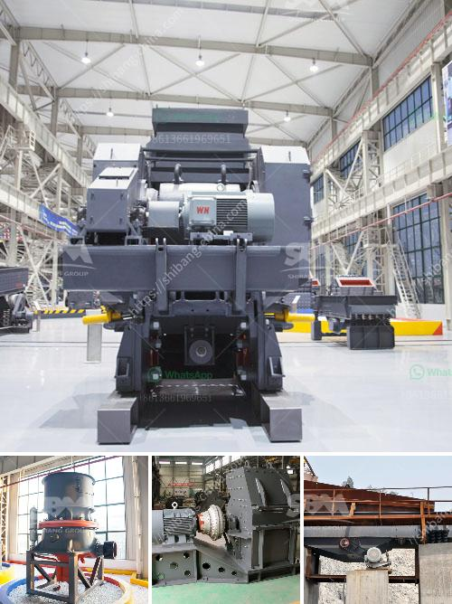

<h3>crusher 300 sampai 400 ton dan hr dijual</h3>
Pertambangan adalah industri yang sangat berat dan memerlukan peralatan yang kuat dan efisien untuk menghancurkan batu-batu besar menjadi ukuran yang lebih kecil. Dalam industri ini, crusher dengan kapasitas tinggi menjadi sangat penting. Salah satu pilihan yang paling populer adalah crusher 300 sampai 400 ton dan hr dijual.

Crusher ini menawarkan solusi tepat untuk memenuhi kebutuhan produksi industri pertambangan. Dengan kapasitas 300 sampai 400 ton per jam, crusher ini dapat menghancurkan batu-batu besar dengan cepat dan efisien. Dapat bekerja 24 jam sehari, peralatan ini sangat cocok untuk penggunaan dalam skala besar.

Salah satu keunggulan utama dari crusher ini adalah efisiensinya yang tinggi. Menggunakan teknologi canggih, crusher ini dapat menghancurkan batu-batu dengan akurasi dan kecepatan tinggi, menghasilkan ukuran batu yang seragam dan sesuai dengan kebutuhan industri. Ini mengurangi biaya dan waktu yang dibutuhkan untuk proses produksi.

Selain itu, crusher ini juga dilengkapi dengan sistem pengumpan otomatis yang membantu memasukkan batu ke dalam mesin dengan konsistensi dan kecepatan yang tepat. Dengan pengaturan yang secara otomatis disesuaikan, crusher ini dapat dengan mudah menyesuaikan diri dengan batu-batu yang dimasukkan ke dalamnya.

Selain memiliki kapasitas yang besar, crusher ini juga dirancang untuk bertahan dalam jangka waktu yang lama. Mesin ini terbuat dari bahan-bahan berkualitas tinggi yang tahan terhadap keausan dan kerusakan. Ini mengurangi biaya perawatan dan penggantian bagian-bagian yang sering terjadi pada mesin yang kurang tahan lama.

Dengan banyaknya keuntungan ini, tidak mengherankan jika crusher 300 sampai 400 ton dan hr dijual menjadi pilihan utama bagi industri pertambangan. Peralatan ini dapat meningkatkan efisiensi produksi, mengurangi biaya, dan menghasilkan hasil yang tepat sesuai dengan kebutuhan. Dengan demikian, crusher ini adalah solusi tepat untuk meningkatkan produktivitas dan keuntungan dalam industri pertambangan.
<h3>Contact us</h3><ul><li><strong>Whatsapp:&nbsp;<a href="https://wa.me/8613661969651">+8613661969651</a></strong></li><li><a href="https://swt.shibang-china.com/?git&amp;zhl&amp;crusher 300 sampai 400 ton dan hr dijual"><strong>Online Service(chat now)</strong></a></li></ul><h3>Related</h3><ul><li><a href='hammer vibrating screens usa.md'>hammer vibrating screens usa</a></li><li><a href='chromite crushing plant in karachi pakistan sale.md'>chromite crushing plant in karachi pakistan sale</a></li><li><a href='mobile crushers zenith.md'>mobile crushers zenith</a></li><li><a href='ball mill operating rpm calculation.md'>ball mill operating rpm calculation</a></li><li><a href='best stone crusher from south africa.md'>best stone crusher from south africa</a></li></ul>