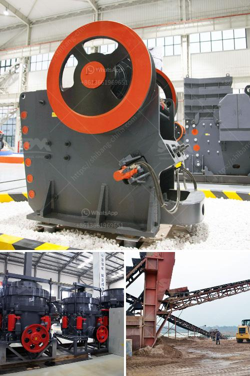

<h3>crusher and mining equipments supplier from china</h3>
China has been a leading country in terms of manufacturing and supplying mining equipment and crushers for decades. However, it is essential to understand the importance of choosing the right supplier amongst the numerous options available in the market. With technological advancements and increased demands for efficient mining processes, a supplier that can provide high-quality equipment and after-sales services becomes crucial. In this context, Chinese suppliers have emerged as reliable partners for mining companies worldwide.

One prominent Chinese supplier that deserves recognition in the mining industry is [Supplier Name]. With years of experience and expertise, they have positioned themselves as a leading manufacturer and exporter of mining equipment in China. Their extensive range of crushers and various mining equipment is designed to meet the diverse needs of mining operations, ensuring maximum productivity and efficiency.

One of the key advantages of choosing a Chinese supplier like [Supplier Name] is their commitment to quality. They adhere to strict quality control measures and use the latest manufacturing technologies to produce reliable and durable mining equipment. Their crushers are manufactured using high-quality materials, ensuring long-lasting performance even in harsh mining environments. Moreover, these suppliers understand the importance of reliable equipment for uninterrupted mining operations, which is why they invest significant resources in research and development to continuously improve the quality and efficiency of their products.

In addition to exceptional quality, Chinese suppliers also provide a comprehensive range of mining equipment to cater to the varying needs of the industry. From jaw crushers and cone crushers to impact crushers and vibrating screens, these suppliers offer a complete set of equipment required for mining operations. This eliminates the hassle of dealing with multiple suppliers and simplifies the procurement process for mining companies.

Apart from the diverse product range, Chinese suppliers also excel in providing excellent after-sales services. They understand that mining equipment may require maintenance, repairs, and timely spare parts to ensure uninterrupted operations. Therefore, they offer comprehensive after-sales support, including technical assistance, spare part availability, and prompt servicing. This ensures that any issues faced by mining companies are quickly resolved, minimizing downtime and maximizing productivity.

Furthermore, Chinese suppliers often provide cost-effective solutions to mining companies. Their ability to produce equipment at competitive prices does not compromise on quality. This advantage allows mining companies with different budget constraints to access top-tier mining equipment without breaking the bank. As a result, they contribute to the overall cost-effectiveness and profitability of mining operations.

In conclusion, Chinese suppliers like [Supplier Name] have proven themselves as reliable partners for mining companies worldwide. Their commitment to quality, extensive product range, excellent after-sales services, and cost-effective solutions make them stand out in the global mining equipment market. Choosing the right supplier is crucial for mining companies aiming for efficiency and sustainability. With their expertise and dedication, Chinese suppliers have become an integral part of the mining industry, supporting the growth and development of mining operations across the globe.
<h3>Contact us</h3><ul><li><strong>Whatsapp:&nbsp;<a href="https://wa.me/8613661969651">+8613661969651</a></strong></li><li><a href="https://swt.shibang-china.com/?git&amp;zhl&amp;crusher and mining equipments supplier from china"><strong>Online Service(chat now)</strong></a></li></ul><h3>Related</h3><ul><li><a href='gypsum powder production line manufacturers germany.md'>gypsum powder production line manufacturers germany</a></li><li><a href='mobile impact crusher for sale.md'>mobile impact crusher for sale</a></li><li><a href='almeida stone crusher.md'>almeida stone crusher</a></li><li><a href='mill price hammer mill.md'>mill price hammer mill</a></li><li><a href='gypsum board manufacturing.md'>gypsum board manufacturing</a></li></ul>