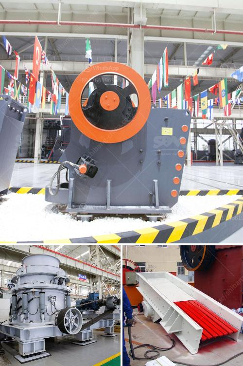

<h3>crusher and screening equipment price in south africa</h3>
Crusher and screening equipment are crucial components in the mining and construction industries. They break down large rocks into smaller, more manageable sizes, allowing for easier transportation and further processing. These machines are in high demand in South Africa due to the booming mining and construction industries.

The price of crushers and screening equipment in South Africa can vary significantly based on brand, size, capability, and capacity. However, it is generally observed that the smaller the size of the crusher, the lower the price tag. Similarly, screening equipment prices can vary based on the number of decks, size of screens, and the overall capacity.

South Africa has several renowned manufacturers and suppliers of crushers and screening equipment. Some of the popular brands in the market include Metso, Sandvik, Osborn, and Pilot Crushtec. These manufacturers offer a wide range of products suitable for different applications, ensuring that customers can find the right equipment to meet their specific needs.

Price comparison is an essential aspect when purchasing crushers and screening equipment. Customers must evaluate their budget and requirements before making a decision. It is advisable to obtain quotes from multiple suppliers and compare features, functions, capabilities, and after-sales services to make an informed decision.

Price is not the only consideration when purchasing crushers and screening equipment. Quality, reliability, durability, and efficiency are equally important factors. Investing in well-built, efficient equipment might cost a bit more upfront but can save money in the long run with reduced downtime and maintenance costs.

South Africa's mining and construction industries are thriving, increasing the demand for crushers and screening equipment. It is crucial for buyers to do thorough research, compare prices, and consider various factors before investing in these machines. By doing so, they can ensure they acquire the right equipment at a fair price, leading to improved productivity and profitability.
<h3>Contact us</h3><ul><li><strong>Whatsapp:&nbsp;<a href="https://wa.me/8613661969651">+8613661969651</a></strong></li><li><a href="https://swt.shibang-china.com/?git&amp;zhl&amp;crusher and screening equipment price in south africa"><strong>Online Service(chat now)</strong></a></li></ul><h3>Related</h3><ul><li><a href='stone crusher dubai.md'>stone crusher dubai</a></li><li><a href='ball mill grinding media work.md'>ball mill grinding media work</a></li><li><a href='south africa limestone crushing and blending plant.md'>south africa limestone crushing and blending plant</a></li><li><a href='price of hammer mill in nigeria.md'>price of hammer mill in nigeria</a></li><li><a href='manganese ball milling machine.md'>manganese ball milling machine</a></li></ul>