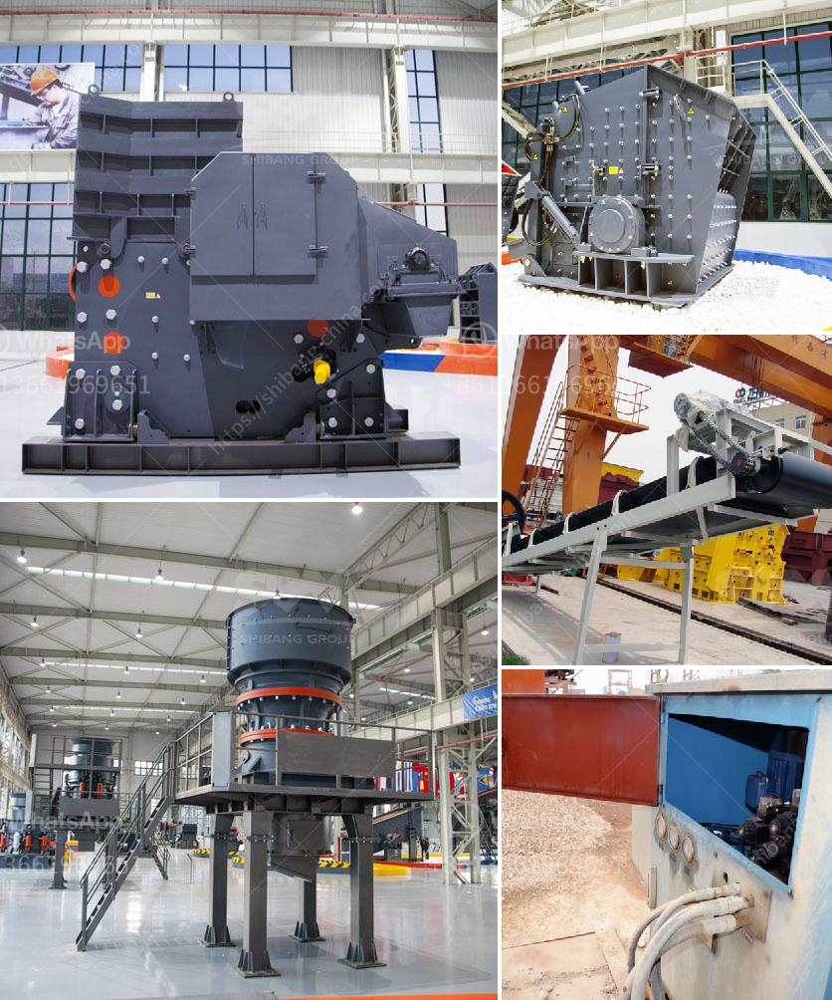

<h3>crusher companies in gauteng</h3>
When it comes to construction and mining projects in Gauteng, crusher companies play a crucial role in the success of these operations. Crushers are used to break down large rocks and stones into smaller particles, which can then be used for various purposes such as road construction, building materials, and landscaping. In Gauteng, there are several reputable crusher companies that offer top-quality equipment and services to meet the needs of their clients.

One of the leading crusher companies in Gauteng is Crushco. With over 10 years of experience in the industry, Crushco has built a solid reputation for providing reliable and efficient crushing solutions. They offer a wide range of crushers, including jaw crushers, impact crushers, cone crushers, and mobile crushers, to cater to diverse project requirements. Crushco's crushers are known for their durability, high performance, and low maintenance requirements, making them a preferred choice for many construction and mining companies.

Another prominent crusher company in Gauteng is Pilot Crushtec. With more than 30 years of industry experience, Pilot Crushtec specializes in the design, manufacturing, sales, and support of mobile and semi-mobile crushing and screening solutions. They offer a wide range of crushers, screens, and scalping equipment, making them a one-stop solution provider for clients in Gauteng. Pilot Crushtec's equipment is known for its versatility, efficiency, and reliability, ensuring maximum productivity for their clients.

Rietspruit Crushers is another crusher company that has made a name for itself in Gauteng. Established in 1960, Rietspruit Crushers is committed to providing reliable and efficient services in the mining and construction industry. Their crushers are known for their precise crushing capabilities, ensuring the production of high-quality aggregates. Rietspruit Crushers also offers a wide range of products, including crushed stone, sand, and gravel, catering to various construction needs.

Apart from these companies, there are numerous other crusher companies in Gauteng that offer a range of crushing solutions. These companies focus on providing personalized services to their clients, ensuring that their unique requirements are met. Whether it is a small-scale construction project or a large mining operation, crusher companies in Gauteng are equipped to handle diverse projects and deliver quality results.

In conclusion, crusher companies in Gauteng play a crucial role in the success of construction and mining projects in the region. With their top-quality equipment and expertise, they ensure efficient and reliable crushing solutions. Whether it is Crushco, Pilot Crushtec, Rietspruit Crushers, or any other renowned crusher company, clients can rest assured that their crushing needs will be met with excellence. These companies are dedicated to providing cost-effective and personalized services, making them invaluable partners for businesses in Gauteng.
<h3>Contact us</h3><ul><li><strong>Whatsapp:&nbsp;<a href="https://wa.me/8613661969651">+8613661969651</a></strong></li><li><a href="https://swt.shibang-china.com/?git&amp;zhl&amp;crusher companies in gauteng"><strong>Online Service(chat now)</strong></a></li></ul><h3>Related</h3><ul><li><a href='cone crusher supply.md'>cone crusher supply</a></li><li><a href='graphite powder machine.md'>graphite powder machine</a></li><li><a href='iron ore processing machine cost.md'>iron ore processing machine cost</a></li><li><a href='copper ore machine in china.md'>copper ore machine in china</a></li><li><a href='the production process of cobblestone.md'>the production process of cobblestone</a></li></ul>